---
theme: white # Or your preferred theme
revealjs:
  width: 960
  height: 700
  margin: 0.1 # Adjust margin as needed
  center: true
---


# Day 1: IPv6 Fundamentals & Core Concepts

<aside class="notes">
Welcome everyone to Day 1 of our Introduction to IPv6 workshop. Over the next three days, our goal is to equip you with the fundamental knowledge and practical skills to understand, deploy, and manage IPv6 networks. We'll be using AWS for our hands-on labs, starting later today. Before we dive deep into IPv6, we'll start with a quick refresher on some key IPv4 concepts to make sure we're all on the same page. This will help highlight the differences and advantages of IPv6 later on. Feel free to ask questions as we go.
</aside>

---


## Module 0: IPv4 Concepts Review (Refresher)

---

<aside class="notes">
This first short module is a quick review of core IPv4 networking concepts. Even if you're familiar with these, it's helpful context before we contrast them with IPv6.
</aside>

---

### IPv4 Address Structure

* **32-bit Addresses:** Limited to ~4.3 billion unique addresses.
* **Dotted-Decimal Notation:** Four 8-bit numbers (0-255), separated by dots.
    * Example: `192.168.1.10`
* **Parts:** Network portion + Host portion.

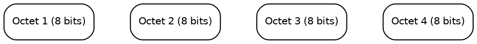

<aside class="notes">
Let's start with the basics. IPv4 addresses, the ones we've used for decades, are 32 bits long. We write them in 'dotted-decimal notation' – four numbers, each representing 8 bits, ranging from 0 to 255, separated by dots. A key concept is that every IPv4 address has two parts: a part that identifies the network the device is on, and a part that identifies the specific device (host) on that network. The dividing line between these parts isn't fixed; it's determined by the subnet mask.
</aside>

---

### Subnet Masks & Prefixes (CIDR)

* **Subnet Mask:** Defines the Network vs. Host portion of an IPv4 address.
    * Example: `255.255.255.0` (The `1`s in binary mark the network bits).
* **Prefix Notation (CIDR):** A more concise way using a slash `/`.
    * `192.168.1.0 /24` is equivalent to `192.168.1.0` with mask `255.255.255.0`.
    * `/24` means the first 24 bits define the network.
* **Purpose:** Allows dividing larger networks into smaller "subnets".

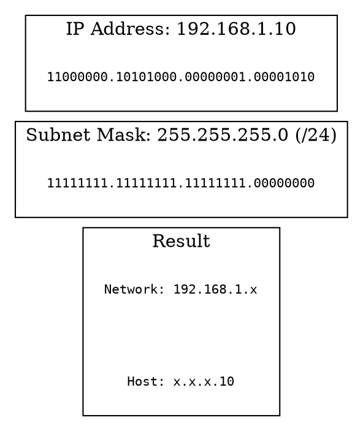

<aside class="notes">
How do we know which part of the address is the network and which is the host? That's the job of the subnet mask. It's another 32-bit number, written in dotted-decimal, where the binary 1s correspond to the network portion of the IP address, and the 0s correspond to the host portion. For example, the common mask `255.255.255.0` means the first 24 bits identify the network, and the last 8 bits identify the host. A more modern and common way to represent this is Classless Inter-Domain Routing, or CIDR notation, using a forward slash followed by the number of network bits. So, `192.168.1.0/24` clearly states the network is `192.168.1` (the first 24 bits) and allows for host addresses using the last 8 bits. Subnetting lets us break large address blocks into smaller, manageable networks.
</aside>

---

### Private vs. Public IP Addresses

* **Public IPs:** Globally unique, routable on the Internet. Assigned by ISPs.
* **Private IPs (RFC 1918):** Reserved ranges for internal use. **Not** routable on the public Internet.
    * `10.0.0.0 /8`
    * `172.16.0.0 /12`
    * `192.168.0.0 /16`
* Requires NAT to communicate with the public Internet.

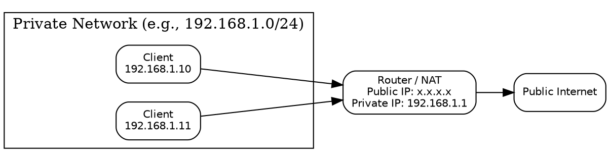

<aside class="notes">
IPv4 addresses come in two main flavors: public and private. Public IP addresses are assigned by Internet Service Providers and must be globally unique; they are used for devices directly communicating on the public internet. Private IP addresses, defined in RFC 1918, are reserved blocks that anyone can use *within* their own private network (like your home or office). These addresses are *not* unique globally and cannot be routed on the public internet. The common private ranges are 10.x.x.x, 172.16.x.x through 172.31.x.x, and 192.168.x.x. To allow devices with private IPs to access the internet, we need Network Address Translation (NAT).
</aside>

---

### NAT (Network Address Translation)

* **Purpose:** Allows Private IPs to access Public Internet via shared Public IP (Address Conservation).
* **How (Basic):** Router translates Private Source IP <-> Public Source IP.
* **Side Effects:** Breaks end-to-end connectivity; adds complexity & state.

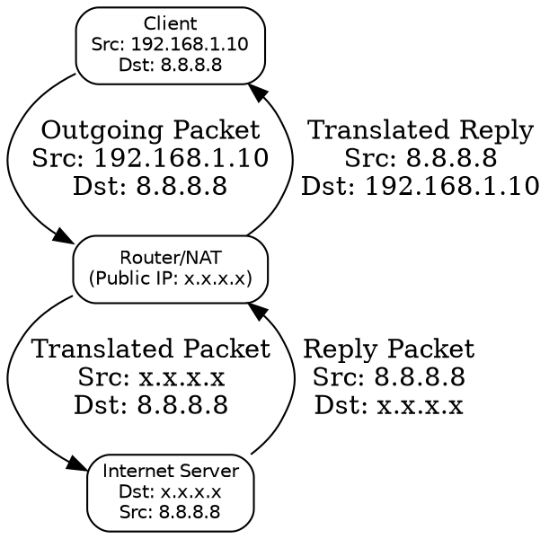

<aside class="notes">
NAT allows multiple devices using private IPs on an internal network to share a single public IP address when communicating with the internet. Your home router is a common example. When your computer (e.g., 192.168.1.10) sends traffic to a website, the router changes the source IP to its own public IP address before sending it out. It keeps track of this connection so when the reply comes back to the router's public IP, it knows to translate the destination IP back to 192.168.1.10 and forward it internally. While essential for conserving scarce IPv4 addresses, NAT introduces complexity, requires the router to maintain connection state, and can interfere with applications that rely on direct end-to-end communication.
</aside>

---

### ARP (Address Resolution Protocol)

* **Purpose:** Maps known IP address -> MAC address on **local** network.
* **How (Basic):** Broadcast "Who has IP B?"; Unicast Reply "I do, my MAC is M."
* **IPv6 Equivalent:** Neighbor Discovery Protocol (NDP) - uses Multicast.

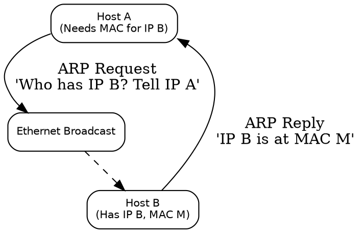

<aside class="notes">
When a device wants to send an IP packet to another device *on the same local network*, it needs to know the destination device's hardware address (MAC address) to frame the packet. ARP handles this in IPv4. If Host A knows Host B's IP but not its MAC, Host A sends out a broadcast message asking 'Who has this IP?'. Host B recognizes its own IP in the request and sends a unicast reply back to Host A containing its MAC address. Host A then stores this mapping in its ARP cache for future use. Remember ARP only works locally. IPv6 uses the Neighbor Discovery Protocol (NDP) for this, using more efficient multicast.
</aside>

---

### DHCP (Dynamic Host Configuration Protocol)

* **Purpose:** Automatically assign IP address & network config.
* **Parameters:** IP Address, Subnet Mask, Default Gateway, DNS Server(s).
* **How (DORA):** Discover -> Offer -> Request -> Acknowledge.
* **IPv6 Equivalents:** DHCPv6 (Stateful) and SLAAC (Stateless).

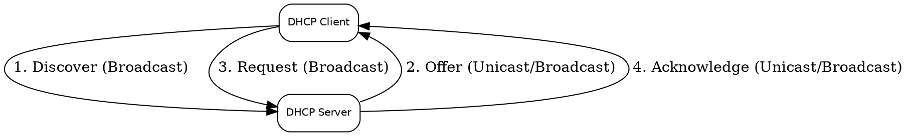

<aside class="notes">
DHCP automates IP configuration. A client device uses DHCP to request settings from a server. The server provides an IP, mask, gateway, and DNS info. The basic process involves 4 steps: Discover, Offer, Request, Acknowledge (DORA). IPv6 has DHCPv6 for similar stateful assignment, but also introduces Stateless Address Autoconfiguration (SLAAC) where devices can often self-assign addresses without DHCP.
</aside>

---

### Unicast, Broadcast, Multicast

* **Unicast:** One-to-One.
* **Broadcast:** One-to-All (on subnet). Inefficient.
* **Multicast:** One-to-Many (subscribed members). Efficient group comms.
* **IPv6:** **Eliminates Broadcast**, uses Multicast extensively.

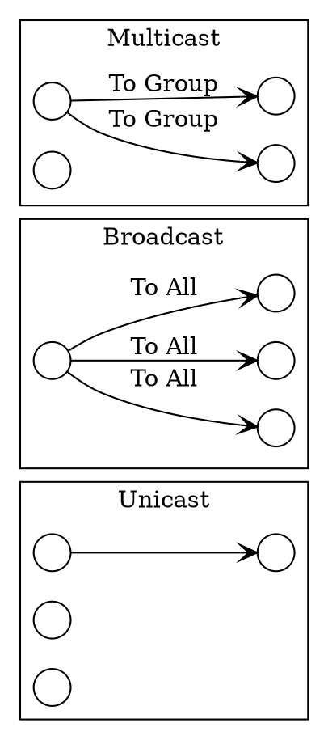

<aside class="notes">
Unicast is standard one-to-one. Broadcast in IPv4 sends a packet to everyone on the local subnet using a special broadcast address (like 192.168.1.255). While used by ARP and DHCP, it's generally inefficient as every host has to process the packet, even if it's not relevant to them. Multicast is a more targeted one-to-many approach. Devices can 'join' a multicast group, and only those members receive packets sent to that group address. This is much more efficient for things like streaming video to multiple viewers or for routing protocol updates. A key change in IPv6 is that it completely gets rid of broadcast addresses and relies on various forms of multicast for communication that needs to reach multiple nodes on a link.
</aside>

---

### IPv4 Review Summary

* **IPv4:** 32-bit, Dotted-Decimal, Mask/CIDR.
* **Addressing:** Public vs. Private (RFC 1918) -> requires NAT.
* **Local Ops:** ARP (IP->MAC), DHCP (Auto-Config).
* **Comms:** Unicast, Broadcast, Multicast.
* **Limitations:** Address Exhaustion, NAT complexity, Broadcast inefficiency.

<aside class="notes">
So, to recap IPv4: 32-bit addresses, NAT needed for private space, ARP/DHCP for local setup, uses broadcast. Key limitations: running out of addresses, NAT issues, broadcast overhead. Now, let's see how IPv6 improves on this.
</aside>

---


## Module 1: Introduction to IPv6

---

<aside class="notes">
Now that we've refreshed our memory on IPv4, let's officially begin Module 1 and dive into IPv6.
</aside>

---

### Workshop Goal & Agenda Recap

* **Goal:** Understand IPv6 fundamentals, addressing, protocol basics, and the lab environment.
* **Today's Agenda:**
    * Why IPv6? Advantages
    * IPv6 Addressing Explained
    * IPv6 Protocol Basics
    * Lab: Exploring the AWS Environment
    * Lab: Basic IPv6 Connectivity & Packet Analysis

<aside class="notes">
As a reminder, today is all about building that foundational knowledge. We'll cover the 'why' and 'what' of IPv6 addressing and the protocol itself. Then, we'll get hands-on in our pre-deployed AWS lab environment to see these concepts in action.
</aside>

---

### Why Do We Need IPv6?

* The Internet is Running Out of Space!
* **Problem:** IPv4 Address Exhaustion
    * ~4.3 billion addresses (32-bit)
    * Rapid Growth: PCs, Mobiles, IoT, Cloud
* **Solution:** IPv6 - A much, much larger address space.

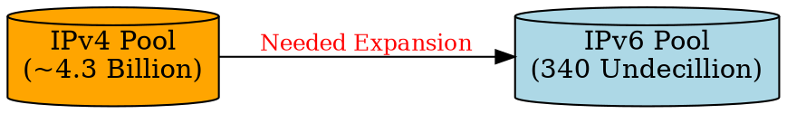

<aside class="notes">
The primary driver for IPv6 is simple: the internet ran out of its original address space, IPv4. IPv4 uses 32-bit addresses, giving us about 4.3 billion unique possibilities. The explosion of personal computers, smartphones, cloud computing, and especially the Internet of Things (IoT) has pushed this limit. Regional Internet Registries (RIRs) have largely exhausted their pools of freely available IPv4 addresses. Workarounds like NAT exist, but they break the end-to-end model of the internet and add complexity. IPv6 was designed specifically to solve this exhaustion problem.
</aside>

---

### IPv4 Address Exhaustion & NAT

* **IPv4 Running Out:** RIRs depleted free pools.
* **Workaround: NAT (Network Address Translation)**
    * Allows multiple private IPs to share one public IP.
    * **Problems:**
        * Breaks End-to-End Principle (Device-to-device comms harder).
        * Adds Complexity & State to networks.
        * Can interfere with some applications (VoIP, P2P, VPNs).
* IPv6 eliminates the *need* for NAT for address conservation.

<aside class="notes">
So, how did we cope with IPv4 running out? The main technique is Network Address Translation, or NAT. Most home networks and many corporate networks use NAT. Your devices get private IP addresses (like 192.168.x.x or 10.x.x.x), and your router translates these to a single public IP address provided by your ISP when you access the internet. While NAT extended IPv4's life, it's fundamentally a patch. It breaks the original internet design principle of direct end-to-end connectivity, making things like peer-to-peer applications, some online games, and certain VPN setups more complicated. Routers doing NAT also need to maintain state, adding load and a potential point of failure. IPv6, with its massive address space, allows every device to potentially have a unique public address, restoring the end-to-end model and removing the need for NAT purely for address saving.
</aside>

---

### Key Advantages of IPv6

* **HUGE Address Space:** 128-bit (3.4 x 10^38)
* **Simplified Header:** Faster router processing.
* **No Need for NAT:** Restores End-to-End connectivity.
* **Stateless Address Autoconfiguration (SLAAC):** Simpler device setup.
* **Built-in Security (IPsec Mandated):** Better baseline security.
* **Improved QoS:** Flow Label field for traffic prioritization.
* **Better Mobility & Multicast:** Enhanced features.

<aside class="notes">
Beyond just solving the address exhaustion problem, IPv6 was designed with improvements based on decades of experience with IPv4. The most obvious advantage is the enormous 128-bit address space – that's 340 undecillion addresses, enough for trillions of devices for the foreseeable future. The header structure is simplified, making it easier and faster for routers to process packets. As mentioned, the need for NAT for address conservation disappears, simplifying networks and restoring direct device-to-device communication. IPv6 includes Stateless Address Autoconfiguration (SLAAC), allowing devices to generate their own addresses without needing a DHCP server in many cases. Security is enhanced because support for IPsec (which provides encryption and authentication) is a mandatory part of the protocol, not an add-on like in IPv4. Quality of Service is improved with fields like the Flow Label, allowing better handling of real-time traffic like voice and video. Finally, it includes built-in enhancements for mobile devices and more efficient multicast.
</aside>

---

### IPv6 History & Adoption

* **Development:** Started early 1990s.
* **Standardization:** RFC 2460 (Dec 1998).
* **Key Milestones:** World IPv6 Launch (2012).
* **Adoption:** Steady global growth, varies by region. Driven by major providers & governments.
* **Future:** Essential for IoT, 5G, Smart Cities.

<aside class="notes">
IPv6 isn't exactly new. Its development started back in the early 1990s when the IETF realized IPv4's limitations. The core specification, RFC 2460, was published in 1998. Adoption was slow initially, but key events like World IPv6 Launch Day in 2012, where major web companies and ISPs permanently enabled IPv6, marked a turning point. Today, global adoption is steadily increasing, although rates vary significantly by country and region. Major content providers like Google and Facebook, along with large ISPs, have been crucial in driving this adoption. Many governments also have mandates encouraging or requiring IPv6 support. Looking ahead, IPv6 is considered fundamental for the growth of future technologies like the massive scale of IoT, 5G mobile networks, and smart city infrastructure.
</aside>

---


## Module 2: Understanding IPv6 Addressing (Part 1)

---

### IPv6 Address Structure

* **128 bits long** (vs. 32 bits for IPv4).
* **Written in Hexadecimal:** 0-9 and a-f.
* **Format:** 8 groups (hextets) of 4 hex digits, separated by colons (`:`).
    * Example: `2001:0db8:85a3:0000:0000:8a2e:0370:7334`

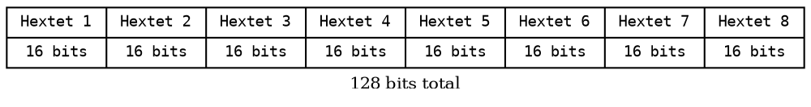

<aside class="notes">
Let's dive into the addresses themselves. The key difference is size: 128 bits for IPv6 compared to 32 for IPv4. Writing 128 bits in binary would be unwieldy, so IPv6 addresses are written in hexadecimal. Hexadecimal uses base-16, so we use digits 0 through 9 and letters 'a' through 'f' (case-insensitive) to represent values 0 through 15. The standard format groups these 128 bits into eight blocks of 16 bits each (called hextets). Each block is represented by four hexadecimal digits, and the blocks are separated by colons. So, a full address looks like the example shown: `2001:0db8:85a3:0000:0000:8a2e:0370:7334`
</aside>

---

### Shortening IPv6 Addresses - Rule 1

* **Rule 1: Omit Leading Zeros**
* Leading zeros *within* any 16-bit block can be omitted.
* Examples: `0db8` -> `db8`, `0000` -> `0`, `0370` -> `370`
* Full Example:
    * `2001:0db8:85a3:0000:0000:8a2e:0370:7334`
    * Becomes: `2001:db8:85a3:0:0:8a2e:370:7334`

<aside class="notes">
Writing out all 32 hexadecimal digits can be tedious, so there are two rules for shortening IPv6 addresses. The first rule is that you can omit any leading zeros within each 4-digit block. For example, if a block is `0db8`, you can write it as `db8`. If a block is `0042`, it becomes `42`. Importantly, if a block consists of all zeros, like `0000`, you must keep at least one zero, so it becomes `0`. Applying this rule to our previous example turns `2001:0db8:85a3:0000:0000:8a2e:0370:7334` into `2001:db8:85a3:0:0:8a2e:370:7334`. Note that trailing zeros cannot be omitted – `0370` becomes `370`, not `37`.
</aside>

---

### Shortening IPv6 Addresses - Rule 2

* **Rule 2: Omit Consecutive Blocks of Zeros (Double Colon)**
* One sequence of consecutive all-zero blocks can be replaced by a double colon `::`.
* **IMPORTANT:** This can only be used **ONCE** per address.
* Example:
    * `2001:db8:85a3:0:0:8a2e:370:7334` -> `2001:db8:85a3::8a2e:370:7334`
* Another Example:
    * `fe80:0:0:0:aaaa:bbbb:cccc:dddd` -> `fe80::aaaa:bbbb:cccc:dddd`

<aside class="notes">
The second rule provides even more compression. If you have one or more *consecutive* blocks that are all zeros (after applying Rule 1, so they look like `:0:`), you can replace that entire sequence with a double colon, `::`. For instance, in `2001:db8:85a3:0:0:8a2e:370:7334`, we have two consecutive zero blocks (`:0:0:`). We can replace this sequence with `::`, resulting in `2001:db8:85a3::8a2e:370:7334`. If the address was `fe80:0:0:0:aaaa:bbbb:cccc:dddd`, the three consecutive zero blocks become `::`, giving `fe80::aaaa:bbbb:cccc:dddd`. The crucial point here is that you can only use the double colon ONCE in an address. If there are multiple sequences of zero blocks, you can only compress one of them (usually the longest sequence is chosen). This is necessary so that someone reading the address can unambiguously determine how many zero blocks the `::` represents by counting the remaining blocks and subtracting from 8.
</aside>

---

### Practice Shortening Addresses

* **Full:** `2001:0db8:0000:0001:0000:0000:0000:abcd`
    * *Answer:* `2001:db8:0:1::abcd` OR `2001:db8::1:0:0:0:abcd` (First is preferred)
* **Full:** `fe80:0000:0000:0000:02a0:c9ff:fe76:5432`
    * *Answer:* `fe80::2a0:c9ff:fe76:5432`
* **Full:** `ff02:0000:0000:0000:0000:0000:0000:0001`
    * *Answer:* `ff02::1`

<aside class="notes">
Let's do a quick practice. Take a minute and try to shorten these addresses using both rules. (Pause)
For the first one, `2001:0db8:0000:0001:0000:0000:0000:abcd`:
Applying Rule 1 gives `2001:db8:0:1:0:0:0:abcd`.
There's a sequence of three zeros. Applying Rule 2 gives `2001:db8:0:1::abcd`. Technically, you *could* compress the single zero block `2001:db8::1:0:0:0:abcd`, but compressing the longest sequence is conventional.
For the second one, `fe80:0000:0000:0000:02a0:c9ff:fe76:5432`:
Rule 1: `fe80:0:0:0:2a0:c9ff:fe76:5432`.
Rule 2 (compressing the three zeros): `fe80::2a0:c9ff:fe76:5432`.
For the third one, `ff02:0000:0000:0000:0000:0000:0000:0001`:
Rule 1: `ff02:0:0:0:0:0:0:1`.
Rule 2 (compressing the seven zeros): `ff02::1`. This is a very common multicast address you'll see later.
</aside>

---

### Address Types & Scopes - Overview

* IPv6 addresses aren't just numbers; they have *types* and *scopes*.
* **Type:** What the address represents (one interface, group of interfaces, etc.)
* **Scope:** Where the address is valid/unique (link, site, global).
* Key Unicast Types:
    * Global Unicast Address (GUA)
    * Link-Local Address (LLA)
    * Unique Local Address (ULA)
* Other Types: Multicast, Anycast, Loopback, Unspecified.

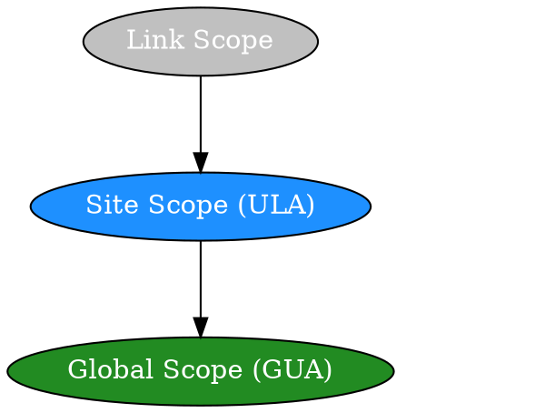

<aside class="notes">
Unlike IPv4 where most addresses we commonly deal with are simply 'public' or 'private', IPv6 addresses have more defined types and scopes. The type tells us what the address identifies - a single interface, a group, the closest of several interfaces, etc. The scope tells us over what range that address is meaningful and unique - just on the local wire (link), within our organization (site), or across the entire internet (global). We'll focus first on the main Unicast types - addresses meant for a single interface. These are Global, Link-Local, and Unique Local addresses. We'll also touch on Multicast, Anycast, and the special Loopback and Unspecified addresses.
</aside>

---

### Global Unicast Addresses (GUA)

* **Purpose:** Globally unique, routable on the public Internet. Like IPv4 public addresses.
* **Format:** Currently assigned range starts with `2000::/3`.
    * Example: `2001:db8:1234:5678::1` (Note: `2001:db8::/32` is reserved for documentation).
* **Structure:** Typically `Global Routing Prefix` + `Subnet ID` + `Interface ID`.
    * ISPs assign prefixes (e.g., /48, /56) to organizations.
    * Organizations create subnets (usually /64).

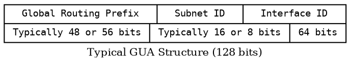

<aside class="notes">
Global Unicast Addresses, or GUAs, are the IPv6 equivalent of public IPv4 addresses. They are intended to be globally unique and routable across the entire internet. The vast majority of GUAs assigned today fall within the `2000::/3` range, meaning they start with binary `001` (hex 2 or 3). A common example prefix you'll see in documentation is `2001:db8::/32`, which is reserved specifically for examples like this and shouldn't appear on the live internet. A typical GUA has a structure: a global routing prefix assigned by an ISP (often a /48 or /56), a subnet ID portion that the organization uses to number its internal networks (creating /64s), and finally the interface ID identifying the specific host on that subnet.
</aside>

---

### Link-Local Addresses (LLA)

* **Purpose:** Communication *only* on a single local network segment (link). Cannot be routed off-link.
* **Required:** Every IPv6 interface *must* have an LLA.
* **Format:** Always starts with `fe80::/10`.
    * Usually `fe80::` followed by Interface ID (often EUI-64 based).
    * Example: `fe80::2a0:c9ff:fe76:5432`
* **Automatic:** Usually configured automatically by the OS. Used for Neighbor Discovery (NDP).
* **Scope Issue:** Must specify *outgoing interface* when using LLAs (e.g., `ping6 fe80::...%eth0`).

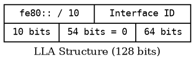

<aside class="notes">
Next are Link-Local Addresses, or LLAs. These are mandatory for every IPv6-enabled interface. Think of them as automatically configured addresses used for basic 'neighbor-to-neighbor' communication on the same physical or logical link (like an Ethernet segment). They are *never* routed beyond that local link. LLAs always fall within the `fe80::/10` prefix. Typically, the operating system automatically generates an LLA for each interface, often using `fe80::` followed by the interface ID derived from the MAC address (EUI-64). These addresses are heavily used by the Neighbor Discovery Protocol (NDP) for things like finding routers and resolving neighbors' MAC addresses. Because LLAs are only unique on a specific link, if you have multiple network interfaces, you need to tell the OS *which interface* to use when sending traffic to an LLA destination. This is often done with a scope identifier, like `%eth0` or `%en0` appended to the address in commands like ping.
</aside>

---

### Unique Local Addresses (ULA)

* **Purpose:** Routable *within* an organization or site, but *not* on the public Internet. Like IPv4 private addresses (RFC1918: 10/8, 172.16/12, 192.168/16).
* **Format:** Starts with `fc00::/7`.
    * Specifically `fd00::/8` is used for locally assigned ULAs.
    * Structure: `fd` + `Global ID (random 40 bits)` + `Subnet ID (16 bits)` + `Interface ID (64 bits)`.
* **Usage:** Internal servers, services, lab environments. Stable internal addressing even if global prefix changes.
* **Globally Unique ID:** The 40-bit Global ID *should* be randomly generated to minimize collision chances if sites merge.

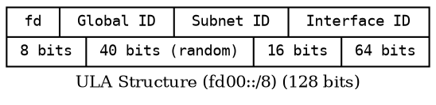

<aside class="notes">
Unique Local Addresses, or ULAs, are the closest equivalent to IPv4 private addresses (like 10.0.0.0/8). They are meant for use *within* a defined site or organization and should *not* be routed on the global internet. They all fall under the `fc00::/7` block, but the standard practice is to use the `fd00::/8` portion for these locally assigned addresses. The address structure includes the `fd` prefix, followed by a 40-bit 'Global ID' which should be randomly generated by the organization to ensure uniqueness (reducing the chance of conflicts if independently administered sites later merge), then a 16-bit Subnet ID for internal network numbering, and finally the 64-bit Interface ID. ULAs are useful for addressing internal resources like servers, printers, or devices in development labs, providing stable internal addresses that don't depend on the GUA prefix assigned by an ISP.
</aside>

---

### Multicast Addresses

* **Purpose:** One-to-Many communication. A single packet delivered to multiple destinations (group members).
* **Format:** Starts with `ff00::/8`.
    * Structure: `ff` + `Flags` + `Scope` + `Group ID`.
* **Examples:**
    * `ff02::1` (All Nodes on Link) [Used by NDP]
    * `ff02::2` (All Routers on Link) [Used by NDP]
    * `ff05::...` (Site-Local Scope)
* **Usage:** Routing protocol updates (OSPFv3, RIPng), service discovery, video streaming. Replaces broadcast in many cases.

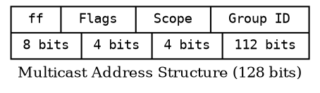

<aside class="notes">
IPv6 makes heavy use of Multicast addresses for one-to-many communication. Instead of sending multiple copies of a packet or using inefficient broadcasts like in some IPv4 scenarios, a source sends a single packet to a multicast address, and the network infrastructure ensures it's delivered to all interfaces that have 'joined' that multicast group. IPv6 multicast addresses always start with `ff` (the `ff00::/8` prefix). The address structure includes flags and a scope field (indicating if it's link-local, site-local, global, etc.) followed by the specific Group ID. You'll frequently encounter `ff02::1`, the link-local all-nodes multicast address, and `ff02::2`, the link-local all-routers multicast address, both heavily used by NDP. Other uses include routing protocols sending updates, discovering services, and efficiently delivering streaming media.
</aside>

---

### Anycast Addresses

* **Purpose:** One-to-Nearest communication. An address assigned to multiple interfaces (usually on different devices).
* **Routing:** Packets sent to an Anycast address are routed to the *closest* interface (in routing protocol terms) assigned that address.
* **Format:** Looks like a standard Unicast address (GUA, ULA). No special prefix. Distinguished by configuration.
* **Usage:** Load balancing, service redundancy (e.g., DNS root servers, CDN nodes).

<aside class="notes">
Anycast is an interesting concept. An Anycast address is syntactically identical to a Unicast address, but it's configured on multiple interfaces, typically on different physical devices often in different locations. The magic happens in the routing: when a packet is sent to an Anycast address, the network's routing protocols direct it to whichever interface holding that address is 'closest' or 'best' according to the routing metric. This 'one-to-nearest' behavior makes Anycast incredibly useful for load balancing and high availability. A prime example is how many DNS root servers are reachable via Anycast addresses – your query goes to the server topologically nearest to you, reducing latency and distributing load. Content Delivery Networks (CDNs) also use Anycast extensively to direct users to the nearest content cache.
</aside>

---

### Quiz 1: IPv6 Basics & Addressing Types

<aside class="notes">
Okay, that covers the basics of why IPv6 and the main address types. Let's do a quick quiz to check our understanding before we move on to the labs.
(Administer Quiz 1 - ~10-15 mins)
How did everyone do? Any questions on those concepts before we explore the lab environment?
</aside>

---

### Lab 1: Exploring the Pre-Deployed AWS Environment

<aside class="notes">
Now it's time for our first lab (~2 hours). We'll log into the AWS accounts prepared for you and take a tour of the IPv6-enabled VPC environment created by the CloudFormation template. The goal is to get comfortable navigating the console and identify the key network components we'll be working with later. Please follow the instructions in your lab guide.
</aside>

---


### LUNCH BREAK (1 Hour)

---


## Module 2: Understanding IPv6 Addressing (Part 2)

---

### Special Addresses

* **Loopback Address:**
    * `::1` (like `127.0.0.1`)
    * Represents the local host. Used for testing local stack.
* **Unspecified Address:**
    * `::` (all zeros)
    * Used as a source address *only* when a host doesn't have an address yet (e.g., during DHCP or NDP initial phases). Cannot be assigned to an interface or used as a destination.

<aside class="notes">
Two special addresses: Loopback `::1` is the host itself, like 127.0.0.1. Unspecified `::` (all zeros) is used only as a source address during initial address acquisition (like DHCP discovery) when the host doesn't have an address yet.
</aside>

---

### Interface Identifiers (IID)

* **Purpose:** Host portion (usually last 64 bits). Identifies interface on subnet.
* **Generation Methods:**
    * **EUI-64:** Derived from MAC address.
    * **Random/Temporary (Privacy Extensions):** OS generates temporary IIDs for privacy.
    * **Manual/Static:** Manually configured.
    * **DHCPv6:** Assigned by server.

<aside class="notes">
The Interface ID (IID) is typically the last 64 bits of an address (with a /64 prefix), identifying the host on the subnet. It can be generated several ways: EUI-64 (from MAC), randomly using Privacy Extensions (common for GUAs to enhance privacy), manually set, or assigned via DHCPv6.
</aside>

---

### EUI-64 Explained

* **Goal:** Create unique 64-bit IID from 48-bit MAC.
* **Process:**
    1.  MAC: `00:1A:2B:3C:4D:5E`
    2.  Split: `001A:2B` | `3C:4D:5E`
    3.  Insert`FFFE`: `001A:2BFF:FE3C:4D:5E`
    4.  Invert 7th bit: `00` -> `02` (U/L bit)
* **Result:** `021A:2BFF:FE3C:4D5E`
* **Example LLA:** `fe80::21a:2bff:fe3c:4d5e`

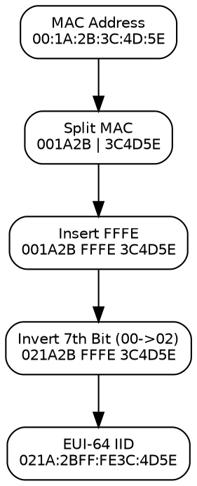

<aside class="notes">
EUI-64 creates a 64-bit IID from a 48-bit MAC.
1.  Take the MAC.
2.  Split it in half.
3.  Insert `FFFE` in the middle.
4.  **Invert the 7th bit** (the Universal/Local bit). If the 7th bit is 0, make it 1; if it's 1, make it 0. This usually changes the first byte (e.g., `00` becomes `02`).
This generates a likely unique IID, often used for LLAs, but reveals the MAC.
</aside>

---

### Prefix Notation & Subnetting

* **Prefix Length:** Like IPv4 CIDR (`/nn`). Defines network portion.
    * Example: `2001:db8:acad:1::/64` (Network: `2001:db8:acad:1`)
* **Common Allocations:**
    * ISP -> Site: `/48` or `/56`
    * Site -> Subnet: `/64` (standard LAN size)
* **Subnetting:** `/48` provides 65,536 `/64` subnets (16 bits for subnetting).

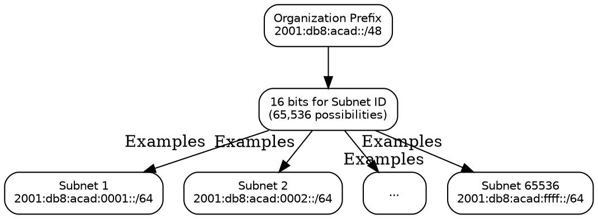

<aside class="notes">
IPv6 uses prefix length notation (`/nn`) like CIDR. `/64` is standard for LAN subnets, leaving 64 bits for the IID. ISPs typically assign /48 or /56 to organizations. A /48 gives 65,536 /64 subnets (64-48=16 subnet bits, 2^16 = 65536), providing plenty of room for internal network segmentation.
</aside>

---


## Module 3: IPv6 Protocol Basics

---

### IPv6 Header Format

* **Simplified & Fixed Length:** 40 bytes.
* **Fewer Fields:** Faster router processing.
* **Key Fields:**
    * Version (6)
    * Traffic Class (QoS)
    * Flow Label (QoS)
    * Payload Length
    * Next Header (Identifies next content: EH or Upper Layer)
    * Hop Limit (Replaces TTL)
    * Source Address (128 bits)
    * Destination Address (128 bits)

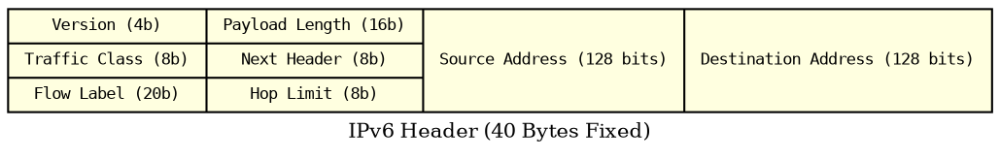

<aside class="notes">
The IPv6 header is simpler and fixed at 40 bytes. Key fields [cite: 289-292]: Version (always 6), Traffic Class & Flow Label (for QoS), Payload Length (data size after header), Next Header (type of next header/protocol), Hop Limit (like TTL, prevents loops), and the 128-bit Source/Destination Addresses.
</aside>

---

### IPv6 vs. IPv4 Header Comparison

| Feature             | IPv4 Header                  | IPv6 Header                     | Reason                                       |
| :------------------ | :--------------------------- | :------------------------------ | :------------------------------------------- |
| Length              | 20+ bytes (Variable)         | 40 bytes (Fixed)                | Faster processing                            |
| Checksum            | Yes                          | **No** | Relies on L2/L4 checksums                    |
| Fragmentation       | Routers & Host               | **Host Only** | Reduces router load                          |
| Options             | In Header                    | **Extension Headers** | More flexible, simple base header            |
| TTL                 | TTL (8 bits)                 | Hop Limit (8 bits)              | More accurate name                           |
| Address Length      | 32 bits                      | 128 bits                        | Address space                                |
| QoS                 | ToS/DiffServ                 | Traffic Class + Flow Label      | Finer QoS control                            |
| Broadcast           | Yes                          | **No** (Uses Multicast)         | Reduces noise                                |

<aside class="notes">
Key differences: IPv6 header is fixed length, has no checksum (faster routing), allows only hosts (not routers) to fragment packets, uses Extension Headers for options, renames TTL to Hop Limit, has much larger addresses, enhanced QoS fields, and replaces broadcast with multicast.
</aside>

---

### Extension Headers (EH)

* **Purpose:** Optional info without bloating main header.
* **Mechanism:** Chained via "Next Header" field. Between IPv6 & Upper-Layer headers.
* **Common Types:** Hop-by-Hop, Routing, Fragment, Destination Options, AH, ESP (IPsec).
* Order matters.

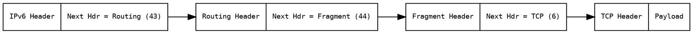

<aside class="notes">
Options and other functionalities are handled by optional Extension Headers, placed between the main header and the payload. They are linked by the 'Next Header' field. Common types [cite: 297-300] handle routing hints, fragmentation, destination-specific options, and security (AH/ESP for IPsec).
</aside>

---

### Neighbor Discovery Protocol (NDP) - Intro

* **Key Protocol** for IPv6 on Local Links (Uses ICMPv6).
* **Replaces/Enhances:** ARP, ICMP Router Discovery, ICMP Redirect.
* **Core Functions:**
    * Router/Prefix/Parameter Discovery (RA/RS)
    * Address Autoconfiguration (SLAAC)
    * Address Resolution (MAC lookup) (NS/NA)
    * Neighbor Unreachability Detection (NUD)
    * Duplicate Address Detection (DAD) (NS/NA)
    * Redirect

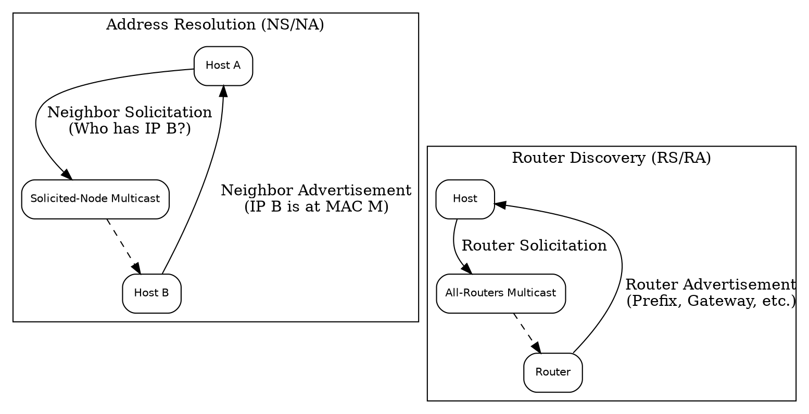

<aside class="notes">
Neighbor Discovery Protocol (NDP) is crucial for local IPv6 operations. It uses ICMPv6 messages to handle tasks done by ARP, ICMP Router Discovery, and Redirects in IPv4. Key functions include finding routers (RS/RA), learning prefixes for autoconfiguration (RA), resolving IPs to MACs (NS/NA - like ARP), checking neighbor reachability (NUD), ensuring address uniqueness (DAD), and redirecting traffic.
</aside>

---

### Quiz 2: IPv6 Addressing Details & Protocol Header

<aside class="notes">
That concludes our deeper dive into addressing and the protocol header. Time for another quick quiz (10-15 mins) to solidify these concepts.
(Administer Quiz 2)
Any questions arising from the quiz or the material we just covered?
</aside>

---

### Lab 2: Basic IPv6 Connectivity and Packet Analysis

<aside class="notes">
Alright, let's get back to the hands-on labs (~3 hours). In Lab 2, we'll connect to the EC2 instances again, practice pinging using different IPv6 address types, and use `tcpdump` to capture and examine the IPv6 and ICMPv6 headers based on what we just learned. Please turn to Lab 2 in your lab guide.
</aside>

---

### Day 1 Wrap-up

* Covered IPv4 Refresher & Why IPv6?
* IPv6 Addressing (Structure, Types, Notation)
* IPv6 Protocol Basics (Header, EHs, NDP Intro)
* Labs: Environment Exploration, Basic Connectivity & Packet Capture
* **Tomorrow:** Migration Strategies (Dual-Stack, Tunneling, Translation) & Labs!

<aside class="notes">
That brings us to the end of Day 1. We've covered the fundamental reasons for IPv6, explored its addressing scheme in detail, looked at the protocol header, and gotten our first taste of IPv6 connectivity and packet analysis in the lab environment. Tomorrow, we'll build on this foundation to look at how we transition from IPv4 to IPv6 using methods like Dual-Stack, Tunneling, and Translation, along with corresponding labs. Any final questions for today?
</aside>

---
theme: white # Or your preferred theme
revealjs:
  width: 960
  height: 700
  margin: 0.1 # Adjust margin as needed
  center: true
---


# Day 1: IPv6 Fundamentals & Core Concepts

<aside class="notes">
Welcome everyone to Day 1 of our Introduction to IPv6 workshop. Over the next three days, our goal is to equip you with the fundamental knowledge and practical skills to understand, deploy, and manage IPv6 networks. We'll be using AWS for our hands-on labs, starting later today. Before we dive deep into IPv6, we'll start with a quick refresher on some key IPv4 concepts to make sure we're all on the same page. This will help highlight the differences and advantages of IPv6 later on. Feel free to ask questions as we go.
</aside>

---


## Module 0: IPv4 Concepts Review (Refresher)

---

<aside class="notes">
This first short module is a quick review of core IPv4 networking concepts. Even if you're familiar with these, it's helpful context before we contrast them with IPv6.
</aside>

---

### IPv4 Address Structure

* **32-bit Addresses:** Limited to ~4.3 billion unique addresses.
* **Dotted-Decimal Notation:** Four 8-bit numbers (0-255), separated by dots.
    * Example: `192.168.1.10`
* **Parts:** Network portion + Host portion.


<aside class="notes">
Let's start with the basics. IPv4 addresses, the ones we've used for decades, are 32 bits long. We write them in 'dotted-decimal notation' – four numbers, each representing 8 bits, ranging from 0 to 255, separated by dots. A key concept is that every IPv4 address has two parts: a part that identifies the network the device is on, and a part that identifies the specific device (host) on that network. The dividing line between these parts isn't fixed; it's determined by the subnet mask.
</aside>

---

### Subnet Masks & Prefixes (CIDR)

* **Subnet Mask:** Defines the Network vs. Host portion of an IPv4 address.
    * Example: `255.255.255.0` (The `1`s in binary mark the network bits).
* **Prefix Notation (CIDR):** A more concise way using a slash `/`.
    * `192.168.1.0 /24` is equivalent to `192.168.1.0` with mask `255.255.255.0`.
    * `/24` means the first 24 bits define the network.
* **Purpose:** Allows dividing larger networks into smaller "subnets".

```graphviz
digraph SubnetMask {
    rankdir=TB;
    node [shape=plaintext, fontname="Courier", fontsize=10];
    subgraph cluster_IP {
        label = "IP Address: 192.168.1.10";
        ip_bits [label="11000000.10101000.00000001.00001010"];
    }
    subgraph cluster_Mask {
        label = "Subnet Mask: 255.255.255.0 (/24)";
        mask_bits [label="11111111.11111111.11111111.00000000"];
    }
    subgraph cluster_Result {
         label = "Result";
         network_part [label="Network: 192.168.1.x"];
         host_part [label="Host: x.x.x.10"];
    }
    ip_bits -> mask_bits [style=invis]; // Align
    mask_bits -> network_part [style=invis];
    network_part -> host_part [style=invis];
}
```

<aside class="notes">
How do we know which part of the address is the network and which is the host? That's the job of the subnet mask. It's another 32-bit number, written in dotted-decimal, where the binary 1s correspond to the network portion of the IP address, and the 0s correspond to the host portion. For example, the common mask `255.255.255.0` means the first 24 bits identify the network, and the last 8 bits identify the host. A more modern and common way to represent this is Classless Inter-Domain Routing, or CIDR notation, using a forward slash followed by the number of network bits. So, `192.168.1.0/24` clearly states the network is `192.168.1` (the first 24 bits) and allows for host addresses using the last 8 bits. Subnetting lets us break large address blocks into smaller, manageable networks.
</aside>

---

### Private vs. Public IP Addresses

* **Public IPs:** Globally unique, routable on the Internet. Assigned by ISPs.
* **Private IPs (RFC 1918):** Reserved ranges for internal use. **Not** routable on the public Internet.
    * `10.0.0.0 /8`
    * `172.16.0.0 /12`
    * `192.168.0.0 /16`
* Requires NAT to communicate with the public Internet.

```graphviz
digraph PrivatePublic {
    rankdir=LR;
    node [shape=box, style=rounded, fontname="Helvetica", fontsize=10];
    subgraph cluster_Private {
        label = "Private Network (e.g., 192.168.1.0/24)";
        Client1 [label="Client\n192.168.1.10"];
        Client2 [label="Client\n192.168.1.11"];
    }
    Router [label="Router / NAT\nPublic IP: x.x.x.x\nPrivate IP: 192.168.1.1"];
    Internet [label="Public Internet", shape=cloud];

    Client1 -> Router;
    Client2 -> Router;
    Router -> Internet;
}
```

<aside class="notes">
IPv4 addresses come in two main flavors: public and private. Public IP addresses are assigned by Internet Service Providers and must be globally unique; they are used for devices directly communicating on the public internet. Private IP addresses, defined in RFC 1918, are reserved blocks that anyone can use *within* their own private network (like your home or office). These addresses are *not* unique globally and cannot be routed on the public internet. The common private ranges are 10.x.x.x, 172.16.x.x through 172.31.x.x, and 192.168.x.x. To allow devices with private IPs to access the internet, we need Network Address Translation (NAT).
</aside>

---

### NAT (Network Address Translation)

* **Purpose:** Allows Private IPs to access Public Internet via shared Public IP (Address Conservation).
* **How (Basic):** Router translates Private Source IP <-> Public Source IP.
* **Side Effects:** Breaks end-to-end connectivity; adds complexity & state.

```graphviz
digraph NAT_Flow {
    rankdir=TB;
    node [shape=box, style=rounded, fontname="Helvetica", fontsize=10];

    Client [label="Client\nSrc: 192.168.1.10\nDst: 8.8.8.8"];
    Router [label="Router/NAT\n(Public IP: x.x.x.x)"];
    Internet [label="Internet Server\nDst: x.x.x.x\nSrc: 8.8.8.8"];

    Client -> Router [label=" Outgoing Packet \n Src: 192.168.1.10 \n Dst: 8.8.8.8 "];
    Router -> Internet [label=" Translated Packet \n Src: x.x.x.x \n Dst: 8.8.8.8 "];
    Internet -> Router [label=" Reply Packet \n Src: 8.8.8.8 \n Dst: x.x.x.x "];
    Router -> Client [label=" Translated Reply \n Src: 8.8.8.8 \n Dst: 192.168.1.10 "];
}
```

<aside class="notes">
NAT allows multiple devices using private IPs on an internal network to share a single public IP address when communicating with the internet. Your home router is a common example. When your computer (e.g., 192.168.1.10) sends traffic to a website, the router changes the source IP to its own public IP address before sending it out. It keeps track of this connection so when the reply comes back to the router's public IP, it knows to translate the destination IP back to 192.168.1.10 and forward it internally. While essential for conserving scarce IPv4 addresses, NAT introduces complexity, requires the router to maintain connection state, and can interfere with applications that rely on direct end-to-end communication.
</aside>

---

### ARP (Address Resolution Protocol)

* **Purpose:** Maps known IP address -> MAC address on **local** network.
* **How (Basic):** Broadcast "Who has IP B?"; Unicast Reply "I do, my MAC is M."
* **IPv6 Equivalent:** Neighbor Discovery Protocol (NDP) - uses Multicast.

```graphviz
digraph ARP_Sequence {
    rankdir=TB;
    node [shape=box, style=rounded, fontname="Helvetica", fontsize=10];

    HostA [label="Host A\n(Needs MAC for IP B)"];
    Broadcast [label="Ethernet Broadcast"];
    HostB [label="Host B\n(Has IP B, MAC M)"];

    HostA -> Broadcast [label=" ARP Request \n 'Who has IP B? Tell IP A' "];
    Broadcast -> HostB [style=dashed]; // Broadcast reaches all, B listens
    HostB -> HostA [label=" ARP Reply \n 'IP B is at MAC M' "];
}
```

<aside class="notes">
When a device wants to send an IP packet to another device *on the same local network*, it needs to know the destination device's hardware address (MAC address) to frame the packet. ARP handles this in IPv4. If Host A knows Host B's IP but not its MAC, Host A sends out a broadcast message asking 'Who has this IP?'. Host B recognizes its own IP in the request and sends a unicast reply back to Host A containing its MAC address. Host A then stores this mapping in its ARP cache for future use. Remember ARP only works locally. IPv6 uses the Neighbor Discovery Protocol (NDP) for this, using more efficient multicast.
</aside>

---

### DHCP (Dynamic Host Configuration Protocol)

* **Purpose:** Automatically assign IP address & network config.
* **Parameters:** IP Address, Subnet Mask, Default Gateway, DNS Server(s).
* **How (DORA):** Discover -> Offer -> Request -> Acknowledge.
* **IPv6 Equivalents:** DHCPv6 (Stateful) and SLAAC (Stateless).

```graphviz
digraph DHCP_DORA {
    rankdir=TB;
    node [shape=box, style=rounded, fontname="Helvetica", fontsize=10];

    Client [label="DHCP Client"];
    Server [label="DHCP Server"];

    Client -> Server [label=" 1. Discover (Broadcast) "];
    Server -> Client [label=" 2. Offer (Unicast/Broadcast) "];
    Client -> Server [label=" 3. Request (Broadcast) "];
    Server -> Client [label=" 4. Acknowledge (Unicast/Broadcast) "];
}
```

<aside class="notes">
DHCP automates IP configuration. A client device uses DHCP to request settings from a server. The server provides an IP, mask, gateway, and DNS info. The basic process involves 4 steps: Discover, Offer, Request, Acknowledge (DORA). IPv6 has DHCPv6 for similar stateful assignment, but also introduces Stateless Address Autoconfiguration (SLAAC) where devices can often self-assign addresses without DHCP.
</aside>

---

### Unicast, Broadcast, Multicast

* **Unicast:** One-to-One.
* **Broadcast:** One-to-All (on subnet). Inefficient.
* **Multicast:** One-to-Many (subscribed members). Efficient group comms.
* **IPv6:** **Eliminates Broadcast**, uses Multicast extensively.

```graphviz
digraph CommTypes {
    rankdir=LR;
    node [shape=circle, label="", width=0.3, height=0.3, fixedsize=true, fontsize=8];
    edge [arrowhead=vee];

    subgraph cluster_Unicast {
        label="Unicast";
        u1 -> u2;
        u3; u4; // unconnected nodes
    }

    subgraph cluster_Broadcast {
        label="Broadcast";
        b1 -> {b2 b3 b4} [label=" To All "];
    }

    subgraph cluster_Multicast {
        label="Multicast";
        m1 -> {m2 m3} [label=" To Group "]; // m4 is not in group
        m4;
    }
}
```

<aside class="notes">
Unicast is standard one-to-one. Broadcast in IPv4 sends a packet to everyone on the local subnet using a special broadcast address (like 192.168.1.255). While used by ARP and DHCP, it's generally inefficient as every host has to process the packet, even if it's not relevant to them. Multicast is a more targeted one-to-many approach. Devices can 'join' a multicast group, and only those members receive packets sent to that group address. This is much more efficient for things like streaming video to multiple viewers or for routing protocol updates. A key change in IPv6 is that it completely gets rid of broadcast addresses and relies on various forms of multicast for communication that needs to reach multiple nodes on a link.
</aside>

---

### IPv4 Review Summary

* **IPv4:** 32-bit, Dotted-Decimal, Mask/CIDR.
* **Addressing:** Public vs. Private (RFC 1918) -> requires NAT.
* **Local Ops:** ARP (IP->MAC), DHCP (Auto-Config).
* **Comms:** Unicast, Broadcast, Multicast.
* **Limitations:** Address Exhaustion, NAT complexity, Broadcast inefficiency.

<aside class="notes">
So, to recap IPv4: 32-bit addresses, NAT needed for private space, ARP/DHCP for local setup, uses broadcast. Key limitations: running out of addresses, NAT issues, broadcast overhead. Now, let's see how IPv6 improves on this.
</aside>

---


## Module 1: Introduction to IPv6

---

<aside class="notes">
Now that we've refreshed our memory on IPv4, let's officially begin Module 1 and dive into IPv6.
</aside>

---

### Workshop Goal & Agenda Recap

* **Goal:** Understand IPv6 fundamentals, addressing, protocol basics, and the lab environment.
* **Today's Agenda:**
    * Why IPv6? Advantages
    * IPv6 Addressing Explained
    * IPv6 Protocol Basics
    * Lab: Exploring the AWS Environment
    * Lab: Basic IPv6 Connectivity & Packet Analysis

<aside class="notes">
As a reminder, today is all about building that foundational knowledge. We'll cover the 'why' and 'what' of IPv6 addressing and the protocol itself. Then, we'll get hands-on in our pre-deployed AWS lab environment to see these concepts in action.
</aside>

---

### Why Do We Need IPv6?

* The Internet is Running Out of Space!
* **Problem:** IPv4 Address Exhaustion
    * ~4.3 billion addresses (32-bit)
    * Rapid Growth: PCs, Mobiles, IoT, Cloud
* **Solution:** IPv6 - A much, much larger address space.

```graphviz
digraph AddressSpace {
    rankdir=LR;
    node [shape=cylinder, style=filled];
    IPv4 [label="IPv4 Pool\n(~4.3 Billion)", fillcolor=orange];
    IPv6 [label="IPv6 Pool\n(340 Undecillion)", fillcolor=lightblue];
    IPv4 -> IPv6 [label=" Needed Expansion ", fontcolor=red, fontsize=12];
}
```

<aside class="notes">
The primary driver for IPv6 is simple: the internet ran out of its original address space, IPv4. IPv4 uses 32-bit addresses, giving us about 4.3 billion unique possibilities. The explosion of personal computers, smartphones, cloud computing, and especially the Internet of Things (IoT) has pushed this limit. Regional Internet Registries (RIRs) have largely exhausted their pools of freely available IPv4 addresses. Workarounds like NAT exist, but they break the end-to-end model of the internet and add complexity. IPv6 was designed specifically to solve this exhaustion problem.
</aside>

---

### IPv4 Address Exhaustion & NAT

* **IPv4 Running Out:** RIRs depleted free pools.
* **Workaround: NAT (Network Address Translation)**
    * Allows multiple private IPs to share one public IP.
    * **Problems:**
        * Breaks End-to-End Principle (Device-to-device comms harder).
        * Adds Complexity & State to networks.
        * Can interfere with some applications (VoIP, P2P, VPNs).
* IPv6 eliminates the *need* for NAT for address conservation.

<aside class="notes">
So, how did we cope with IPv4 running out? The main technique is Network Address Translation, or NAT. Most home networks and many corporate networks use NAT. Your devices get private IP addresses (like 192.168.x.x or 10.x.x.x), and your router translates these to a single public IP address provided by your ISP when you access the internet. While NAT extended IPv4's life, it's fundamentally a patch. It breaks the original internet design principle of direct end-to-end connectivity, making things like peer-to-peer applications, some online games, and certain VPN setups more complicated. Routers doing NAT also need to maintain state, adding load and a potential point of failure. IPv6, with its massive address space, allows every device to potentially have a unique public address, restoring the end-to-end model and removing the need for NAT purely for address saving.
</aside>

---

### Key Advantages of IPv6

* **HUGE Address Space:** 128-bit (3.4 x 10^38)
* **Simplified Header:** Faster router processing.
* **No Need for NAT:** Restores End-to-End connectivity.
* **Stateless Address Autoconfiguration (SLAAC):** Simpler device setup.
* **Built-in Security (IPsec Mandated):** Better baseline security.
* **Improved QoS:** Flow Label field for traffic prioritization.
* **Better Mobility & Multicast:** Enhanced features.

<aside class="notes">
Beyond just solving the address exhaustion problem, IPv6 was designed with improvements based on decades of experience with IPv4. The most obvious advantage is the enormous 128-bit address space – that's 340 undecillion addresses, enough for trillions of devices for the foreseeable future. The header structure is simplified, making it easier and faster for routers to process packets. As mentioned, the need for NAT for address conservation disappears, simplifying networks and restoring direct device-to-device communication. IPv6 includes Stateless Address Autoconfiguration (SLAAC), allowing devices to generate their own addresses without needing a DHCP server in many cases. Security is enhanced because support for IPsec (which provides encryption and authentication) is a mandatory part of the protocol, not an add-on like in IPv4. Quality of Service is improved with fields like the Flow Label, allowing better handling of real-time traffic like voice and video. Finally, it includes built-in enhancements for mobile devices and more efficient multicast.
</aside>

---

### IPv6 History & Adoption

* **Development:** Started early 1990s.
* **Standardization:** RFC 2460 (Dec 1998).
* **Key Milestones:** World IPv6 Launch (2012).
* **Adoption:** Steady global growth, varies by region. Driven by major providers & governments.
* **Future:** Essential for IoT, 5G, Smart Cities.

<aside class="notes">
IPv6 isn't exactly new. Its development started back in the early 1990s when the IETF realized IPv4's limitations. The core specification, RFC 2460, was published in 1998. Adoption was slow initially, but key events like World IPv6 Launch Day in 2012, where major web companies and ISPs permanently enabled IPv6, marked a turning point. Today, global adoption is steadily increasing, although rates vary significantly by country and region. Major content providers like Google and Facebook, along with large ISPs, have been crucial in driving this adoption. Many governments also have mandates encouraging or requiring IPv6 support. Looking ahead, IPv6 is considered fundamental for the growth of future technologies like the massive scale of IoT, 5G mobile networks, and smart city infrastructure.
</aside>

---


## Module 2: Understanding IPv6 Addressing (Part 1)

---

### IPv6 Address Structure

* **128 bits long** (vs. 32 bits for IPv4).
* **Written in Hexadecimal:** 0-9 and a-f.
* **Format:** 8 groups (hextets) of 4 hex digits, separated by colons (`:`).
    * Example: `2001:0db8:85a3:0000:0000:8a2e:0370:7334`

```graphviz
digraph IPv6Structure {
    rankdir=LR;
    node [shape=record, fontname="Courier", fontsize=9]; // Use record shape for segments
    addr [label="{ Hextet 1 | Hextet 2 | Hextet 3 | Hextet 4 | Hextet 5 | Hextet 6 | Hextet 7 | Hextet 8 } | { 16 bits | 16 bits | 16 bits | 16 bits | 16 bits | 16 bits | 16 bits | 16 bits }"];
    label = "128 bits total";
    fontsize=10;
}
```

<aside class="notes">
Let's dive into the addresses themselves. The key difference is size: 128 bits for IPv6 compared to 32 for IPv4. Writing 128 bits in binary would be unwieldy, so IPv6 addresses are written in hexadecimal. Hexadecimal uses base-16, so we use digits 0 through 9 and letters 'a' through 'f' (case-insensitive) to represent values 0 through 15. The standard format groups these 128 bits into eight blocks of 16 bits each (called hextets). Each block is represented by four hexadecimal digits, and the blocks are separated by colons. So, a full address looks like the example shown: `2001:0db8:85a3:0000:0000:8a2e:0370:7334`
</aside>

---

### Shortening IPv6 Addresses - Rule 1

* **Rule 1: Omit Leading Zeros**
* Leading zeros *within* any 16-bit block can be omitted.
* Examples: `0db8` -> `db8`, `0000` -> `0`, `0370` -> `370`
* Full Example:
    * `2001:0db8:85a3:0000:0000:8a2e:0370:7334`
    * Becomes: `2001:db8:85a3:0:0:8a2e:370:7334`

<aside class="notes">
Writing out all 32 hexadecimal digits can be tedious, so there are two rules for shortening IPv6 addresses. The first rule is that you can omit any leading zeros within each 4-digit block. For example, if a block is `0db8`, you can write it as `db8`. If a block is `0042`, it becomes `42`. Importantly, if a block consists of all zeros, like `0000`, you must keep at least one zero, so it becomes `0`. Applying this rule to our previous example turns `2001:0db8:85a3:0000:0000:8a2e:0370:7334` into `2001:db8:85a3:0:0:8a2e:370:7334`. Note that trailing zeros cannot be omitted – `0370` becomes `370`, not `37`.
</aside>

---

### Shortening IPv6 Addresses - Rule 2

* **Rule 2: Omit Consecutive Blocks of Zeros (Double Colon)**
* One sequence of consecutive all-zero blocks can be replaced by a double colon `::`.
* **IMPORTANT:** This can only be used **ONCE** per address.
* Example:
    * `2001:db8:85a3:0:0:8a2e:370:7334` -> `2001:db8:85a3::8a2e:370:7334`
* Another Example:
    * `fe80:0:0:0:aaaa:bbbb:cccc:dddd` -> `fe80::aaaa:bbbb:cccc:dddd`

<aside class="notes">
The second rule provides even more compression. If you have one or more *consecutive* blocks that are all zeros (after applying Rule 1, so they look like `:0:`), you can replace that entire sequence with a double colon, `::`. For instance, in `2001:db8:85a3:0:0:8a2e:370:7334`, we have two consecutive zero blocks (`:0:0:`). We can replace this sequence with `::`, resulting in `2001:db8:85a3::8a2e:370:7334`. If the address was `fe80:0:0:0:aaaa:bbbb:cccc:dddd`, the three consecutive zero blocks become `::`, giving `fe80::aaaa:bbbb:cccc:dddd`. The crucial point here is that you can only use the double colon ONCE in an address. If there are multiple sequences of zero blocks, you can only compress one of them (usually the longest sequence is chosen). This is necessary so that someone reading the address can unambiguously determine how many zero blocks the `::` represents by counting the remaining blocks and subtracting from 8.
</aside>

---

### Practice Shortening Addresses

* **Full:** `2001:0db8:0000:0001:0000:0000:0000:abcd`
    * *Answer:* `2001:db8:0:1::abcd` OR `2001:db8::1:0:0:0:abcd` (First is preferred)
* **Full:** `fe80:0000:0000:0000:02a0:c9ff:fe76:5432`
    * *Answer:* `fe80::2a0:c9ff:fe76:5432`
* **Full:** `ff02:0000:0000:0000:0000:0000:0000:0001`
    * *Answer:* `ff02::1`

<aside class="notes">
Let's do a quick practice. Take a minute and try to shorten these addresses using both rules. (Pause)
For the first one, `2001:0db8:0000:0001:0000:0000:0000:abcd`:
Applying Rule 1 gives `2001:db8:0:1:0:0:0:abcd`.
There's a sequence of three zeros. Applying Rule 2 gives `2001:db8:0:1::abcd`. Technically, you *could* compress the single zero block `2001:db8::1:0:0:0:abcd`, but compressing the longest sequence is conventional.
For the second one, `fe80:0000:0000:0000:02a0:c9ff:fe76:5432`:
Rule 1: `fe80:0:0:0:2a0:c9ff:fe76:5432`.
Rule 2 (compressing the three zeros): `fe80::2a0:c9ff:fe76:5432`.
For the third one, `ff02:0000:0000:0000:0000:0000:0000:0001`:
Rule 1: `ff02:0:0:0:0:0:0:1`.
Rule 2 (compressing the seven zeros): `ff02::1`. This is a very common multicast address you'll see later.
</aside>

---

### Address Types & Scopes - Overview

* IPv6 addresses aren't just numbers; they have *types* and *scopes*.
* **Type:** What the address represents (one interface, group of interfaces, etc.)
* **Scope:** Where the address is valid/unique (link, site, global).
* Key Unicast Types:
    * Global Unicast Address (GUA)
    * Link-Local Address (LLA)
    * Unique Local Address (ULA)
* Other Types: Multicast, Anycast, Loopback, Unspecified.

```graphviz
digraph Scopes {
    rankdir=TD;
    // Set default node style including fontcolor for dark backgrounds
    node [shape=ellipse, style=filled, fontcolor=white];
    // Set edge default fontcolor too
    edge [fontcolor=white];

    // Define nodes with their specific fill colors (using standard names)
    Link [label="Link Scope", fillcolor=grey];
    Site [label="Site Scope (ULA)", fillcolor=dodgerblue];
    Global [label="Global Scope (GUA)", fillcolor=forestgreen]; // Changed from lightgreen

    Link -> Site -> Global [label=" Increasing Reachability "];
}
```

<aside class="notes">
Unlike IPv4 where most addresses we commonly deal with are simply 'public' or 'private', IPv6 addresses have more defined types and scopes. The type tells us what the address identifies - a single interface, a group, the closest of several interfaces, etc. The scope tells us over what range that address is meaningful and unique - just on the local wire (link), within our organization (site), or across the entire internet (global). We'll focus first on the main Unicast types - addresses meant for a single interface. These are Global, Link-Local, and Unique Local addresses. We'll also touch on Multicast, Anycast, and the special Loopback and Unspecified addresses.
</aside>

---

### Global Unicast Addresses (GUA)

* **Purpose:** Globally unique, routable on the public Internet. Like IPv4 public addresses.
* **Format:** Currently assigned range starts with `2000::/3`.
    * Example: `2001:db8:1234:5678::1` (Note: `2001:db8::/32` is reserved for documentation).
* **Structure:** Typically `Global Routing Prefix` + `Subnet ID` + `Interface ID`.
    * ISPs assign prefixes (e.g., /48, /56) to organizations.
    * Organizations create subnets (usually /64).

```graphviz
digraph GUA_Structure {
    rankdir=LR;
    node [shape=record, fontname="Courier", fontsize=9];
    gua [label="{ Global Routing Prefix | Subnet ID | Interface ID } | { Typically 48 or 56 bits | Typically 16 or 8 bits | 64 bits }"];
    label = "Typical GUA Structure (128 bits)";
    fontsize=10;
}
```

<aside class="notes">
Global Unicast Addresses, or GUAs, are the IPv6 equivalent of public IPv4 addresses. They are intended to be globally unique and routable across the entire internet. The vast majority of GUAs assigned today fall within the `2000::/3` range, meaning they start with binary `001` (hex 2 or 3). A common example prefix you'll see in documentation is `2001:db8::/32`, which is reserved specifically for examples like this and shouldn't appear on the live internet. A typical GUA has a structure: a global routing prefix assigned by an ISP (often a /48 or /56), a subnet ID portion that the organization uses to number its internal networks (creating /64s), and finally the interface ID identifying the specific host on that subnet.
</aside>

---

### Link-Local Addresses (LLA)

* **Purpose:** Communication *only* on a single local network segment (link). Cannot be routed off-link.
* **Required:** Every IPv6 interface *must* have an LLA.
* **Format:** Always starts with `fe80::/10`.
    * Usually `fe80::` followed by Interface ID (often EUI-64 based).
    * Example: `fe80::2a0:c9ff:fe76:5432`
* **Automatic:** Usually configured automatically by the OS. Used for Neighbor Discovery (NDP).
* **Scope Issue:** Must specify *outgoing interface* when using LLAs (e.g., `ping6 fe80::...%eth0`).

```graphviz
digraph LLA_Structure {
    rankdir=LR;
    node [shape=record, fontname="Courier", fontsize=9];
    lla [label="{ fe80:: / 10 | Interface ID } | { 10 bits | 54 bits = 0 | 64 bits }"];
    label = "LLA Structure (128 bits)";
    fontsize=10;
}
```

<aside class="notes">
Next are Link-Local Addresses, or LLAs. These are mandatory for every IPv6-enabled interface. Think of them as automatically configured addresses used for basic 'neighbor-to-neighbor' communication on the same physical or logical link (like an Ethernet segment). They are *never* routed beyond that local link. LLAs always fall within the `fe80::/10` prefix. Typically, the operating system automatically generates an LLA for each interface, often using `fe80::` followed by the interface ID derived from the MAC address (EUI-64). These addresses are heavily used by the Neighbor Discovery Protocol (NDP) for things like finding routers and resolving neighbors' MAC addresses. Because LLAs are only unique on a specific link, if you have multiple network interfaces, you need to tell the OS *which interface* to use when sending traffic to an LLA destination. This is often done with a scope identifier, like `%eth0` or `%en0` appended to the address in commands like ping.
</aside>

---

### Unique Local Addresses (ULA)

* **Purpose:** Routable *within* an organization or site, but *not* on the public Internet. Like IPv4 private addresses (RFC1918: 10/8, 172.16/12, 192.168/16).
* **Format:** Starts with `fc00::/7`.
    * Specifically `fd00::/8` is used for locally assigned ULAs.
    * Structure: `fd` + `Global ID (random 40 bits)` + `Subnet ID (16 bits)` + `Interface ID (64 bits)`.
* **Usage:** Internal servers, services, lab environments. Stable internal addressing even if global prefix changes.
* **Globally Unique ID:** The 40-bit Global ID *should* be randomly generated to minimize collision chances if sites merge.

```graphviz
digraph ULA_Structure {
    rankdir=LR;
    node [shape=record, fontname="Courier", fontsize=9];
    ula [label="{ fd | Global ID | Subnet ID | Interface ID } | { 8 bits | 40 bits (random) | 16 bits | 64 bits }"];
    label = "ULA Structure (fd00::/8) (128 bits)";
    fontsize=10;
}
```

<aside class="notes">
Unique Local Addresses, or ULAs, are the closest equivalent to IPv4 private addresses (like 10.0.0.0/8). They are meant for use *within* a defined site or organization and should *not* be routed on the global internet. They all fall under the `fc00::/7` block, but the standard practice is to use the `fd00::/8` portion for these locally assigned addresses. The address structure includes the `fd` prefix, followed by a 40-bit 'Global ID' which should be randomly generated by the organization to ensure uniqueness (reducing the chance of conflicts if independently administered sites later merge), then a 16-bit Subnet ID for internal network numbering, and finally the 64-bit Interface ID. ULAs are useful for addressing internal resources like servers, printers, or devices in development labs, providing stable internal addresses that don't depend on the GUA prefix assigned by an ISP.
</aside>

---

### Multicast Addresses

* **Purpose:** One-to-Many communication. A single packet delivered to multiple destinations (group members).
* **Format:** Starts with `ff00::/8`.
    * Structure: `ff` + `Flags` + `Scope` + `Group ID`.
* **Examples:**
    * `ff02::1` (All Nodes on Link) [Used by NDP]
    * `ff02::2` (All Routers on Link) [Used by NDP]
    * `ff05::...` (Site-Local Scope)
* **Usage:** Routing protocol updates (OSPFv3, RIPng), service discovery, video streaming. Replaces broadcast in many cases.

```graphviz
digraph MCAST_Structure {
    rankdir=LR;
    node [shape=record, fontname="Courier", fontsize=9];
    mcast [label="{ ff | Flags | Scope | Group ID } | { 8 bits | 4 bits | 4 bits | 112 bits }"];
    label = "Multicast Address Structure (128 bits)";
    fontsize=10;
}
```

<aside class="notes">
IPv6 makes heavy use of Multicast addresses for one-to-many communication. Instead of sending multiple copies of a packet or using inefficient broadcasts like in some IPv4 scenarios, a source sends a single packet to a multicast address, and the network infrastructure ensures it's delivered to all interfaces that have 'joined' that multicast group. IPv6 multicast addresses always start with `ff` (the `ff00::/8` prefix). The address structure includes flags and a scope field (indicating if it's link-local, site-local, global, etc.) followed by the specific Group ID. You'll frequently encounter `ff02::1`, the link-local all-nodes multicast address, and `ff02::2`, the link-local all-routers multicast address, both heavily used by NDP. Other uses include routing protocols sending updates, discovering services, and efficiently delivering streaming media.
</aside>

---

### Anycast Addresses

* **Purpose:** One-to-Nearest communication. An address assigned to multiple interfaces (usually on different devices).
* **Routing:** Packets sent to an Anycast address are routed to the *closest* interface (in routing protocol terms) assigned that address.
* **Format:** Looks like a standard Unicast address (GUA, ULA). No special prefix. Distinguished by configuration.
* **Usage:** Load balancing, service redundancy (e.g., DNS root servers, CDN nodes).

<aside class="notes">
Anycast is an interesting concept. An Anycast address is syntactically identical to a Unicast address, but it's configured on multiple interfaces, typically on different physical devices often in different locations. The magic happens in the routing: when a packet is sent to an Anycast address, the network's routing protocols direct it to whichever interface holding that address is 'closest' or 'best' according to the routing metric. This 'one-to-nearest' behavior makes Anycast incredibly useful for load balancing and high availability. A prime example is how many DNS root servers are reachable via Anycast addresses – your query goes to the server topologically nearest to you, reducing latency and distributing load. Content Delivery Networks (CDNs) also use Anycast extensively to direct users to the nearest content cache.
</aside>

---

### Quiz 1: IPv6 Basics & Addressing Types

<aside class="notes">
Okay, that covers the basics of why IPv6 and the main address types. Let's do a quick quiz to check our understanding before we move on to the labs.
(Administer Quiz 1 - ~10-15 mins)
How did everyone do? Any questions on those concepts before we explore the lab environment?
</aside>

---

### Lab 1: Exploring the Pre-Deployed AWS Environment

<aside class="notes">
Now it's time for our first lab (~2 hours). We'll log into the AWS accounts prepared for you and take a tour of the IPv6-enabled VPC environment created by the CloudFormation template. The goal is to get comfortable navigating the console and identify the key network components we'll be working with later. Please follow the instructions in your lab guide.
</aside>

---


### LUNCH BREAK (1 Hour)

---


## Module 2: Understanding IPv6 Addressing (Part 2)

---

### Special Addresses

* **Loopback Address:**
    * `::1` (like `127.0.0.1`)
    * Represents the local host. Used for testing local stack.
* **Unspecified Address:**
    * `::` (all zeros)
    * Used as a source address *only* when a host doesn't have an address yet (e.g., during DHCP or NDP initial phases). Cannot be assigned to an interface or used as a destination.

<aside class="notes">
Two special addresses: Loopback `::1` is the host itself, like 127.0.0.1. Unspecified `::` (all zeros) is used only as a source address during initial address acquisition (like DHCP discovery) when the host doesn't have an address yet.
</aside>

---

### Interface Identifiers (IID)

* **Purpose:** Host portion (usually last 64 bits). Identifies interface on subnet.
* **Generation Methods:**
    * **EUI-64:** Derived from MAC address.
    * **Random/Temporary (Privacy Extensions):** OS generates temporary IIDs for privacy.
    * **Manual/Static:** Manually configured.
    * **DHCPv6:** Assigned by server.

<aside class="notes">
The Interface ID (IID) is typically the last 64 bits of an address (with a /64 prefix), identifying the host on the subnet. It can be generated several ways: EUI-64 (from MAC), randomly using Privacy Extensions (common for GUAs to enhance privacy), manually set, or assigned via DHCPv6.
</aside>

---

### EUI-64 Explained

* **Goal:** Create unique 64-bit IID from 48-bit MAC.
* **Process:**
    1.  MAC: `00:1A:2B:3C:4D:5E`
    2.  Split: `001A:2B` | `3C:4D:5E`
    3.  Insert`FFFE`: `001A:2BFF:FE3C:4D:5E`
    4.  Invert 7th bit: `00` -> `02` (U/L bit)
* **Result:** `021A:2BFF:FE3C:4D5E`
* **Example LLA:** `fe80::21a:2bff:fe3c:4d5e`

```graphviz
digraph EUI64_Process {
    rankdir=TB;
    node [shape=box, style=rounded, fontname="Helvetica", fontsize=10];

    MAC [label="MAC Address\n00:1A:2B:3C:4D:5E"];
    Split [label="Split MAC\n001A2B | 3C4D5E"];
    Insert [label="Insert FFFE\n001A2B FFFE 3C4D5E"];
    Invert [label="Invert 7th Bit (00->02)\n021A2B FFFE 3C4D5E"];
    Result [label="EUI-64 IID\n021A:2BFF:FE3C:4D5E"];

    MAC -> Split -> Insert -> Invert -> Result;
}
```

<aside class="notes">
EUI-64 creates a 64-bit IID from a 48-bit MAC.
1.  Take the MAC.
2.  Split it in half.
3.  Insert `FFFE` in the middle.
4.  **Invert the 7th bit** (the Universal/Local bit). If the 7th bit is 0, make it 1; if it's 1, make it 0. This usually changes the first byte (e.g., `00` becomes `02`).
This generates a likely unique IID, often used for LLAs, but reveals the MAC.
</aside>

---

### Prefix Notation & Subnetting

* **Prefix Length:** Like IPv4 CIDR (`/nn`). Defines network portion.
    * Example: `2001:db8:acad:1::/64` (Network: `2001:db8:acad:1`)
* **Common Allocations:**
    * ISP -> Site: `/48` or `/56`
    * Site -> Subnet: `/64` (standard LAN size)
* **Subnetting:** `/48` provides 65,536 `/64` subnets (16 bits for subnetting).

```graphviz
digraph Subnetting {
    rankdir=TB;
    node [shape=box, style=rounded, fontname="Helvetica", fontsize=10];

    Prefix48 [label="Organization Prefix\n2001:db8:acad::/48"];
    SubnetBits [label="16 bits for Subnet ID\n(65,536 possibilities)"];
    Subnet1 [label="Subnet 1\n2001:db8:acad:0001::/64"];
    Subnet2 [label="Subnet 2\n2001:db8:acad:0002::/64"];
    SubnetN [label="..."];
    SubnetLast [label="Subnet 65536\n2001:db8:acad:ffff::/64"];

    Prefix48 -> SubnetBits;
    SubnetBits -> {Subnet1; Subnet2; SubnetN; SubnetLast;} [xlabel="Examples"];
}
```

<aside class="notes">
IPv6 uses prefix length notation (`/nn`) like CIDR. `/64` is standard for LAN subnets, leaving 64 bits for the IID. ISPs typically assign /48 or /56 to organizations. A /48 gives 65,536 /64 subnets (64-48=16 subnet bits, 2^16 = 65536), providing plenty of room for internal network segmentation.
</aside>

---


## Module 3: IPv6 Protocol Basics

---

### IPv6 Header Format

* **Simplified & Fixed Length:** 40 bytes.
* **Fewer Fields:** Faster router processing.
* **Key Fields:**
    * Version (6)
    * Traffic Class (QoS)
    * Flow Label (QoS)
    * Payload Length
    * Next Header (Identifies next content: EH or Upper Layer)
    * Hop Limit (Replaces TTL)
    * Source Address (128 bits)
    * Destination Address (128 bits)

```graphviz
digraph IPv6Header {
    rankdir=TB;
    node [shape=record, fontname="Courier", fontsize=8, style=filled, fillcolor=lightyellow];

    hdr [label="{ <f0> Version (4b) | <f1> Traffic Class (8b) | <f2> Flow Label (20b) } | \
                { <f3> Payload Length (16b) | <f4> Next Header (8b) | <f5> Hop Limit (8b) } | \
                { <f6> Source Address (128 bits) } | \
                { <f7> Destination Address (128 bits) }"];
    label = "IPv6 Header (40 Bytes Fixed)";
    fontsize=10;
}
```

<aside class="notes">
The IPv6 header is simpler and fixed at 40 bytes. Key fields [cite: 289-292]: Version (always 6), Traffic Class & Flow Label (for QoS), Payload Length (data size after header), Next Header (type of next header/protocol), Hop Limit (like TTL, prevents loops), and the 128-bit Source/Destination Addresses.
</aside>

---

### IPv6 vs. IPv4 Header Comparison

| Feature             | IPv4 Header                  | IPv6 Header                     | Reason                                       |
| :------------------ | :--------------------------- | :------------------------------ | :------------------------------------------- |
| Length              | 20+ bytes (Variable)         | 40 bytes (Fixed)                | Faster processing                            |
| Checksum            | Yes                          | **No** | Relies on L2/L4 checksums                    |
| Fragmentation       | Routers & Host               | **Host Only** | Reduces router load                          |
| Options             | In Header                    | **Extension Headers** | More flexible, simple base header            |
| TTL                 | TTL (8 bits)                 | Hop Limit (8 bits)              | More accurate name                           |
| Address Length      | 32 bits                      | 128 bits                        | Address space                                |
| QoS                 | ToS/DiffServ                 | Traffic Class + Flow Label      | Finer QoS control                            |
| Broadcast           | Yes                          | **No** (Uses Multicast)         | Reduces noise                                |

<aside class="notes">
Key differences: IPv6 header is fixed length, has no checksum (faster routing), allows only hosts (not routers) to fragment packets, uses Extension Headers for options, renames TTL to Hop Limit, has much larger addresses, enhanced QoS fields, and replaces broadcast with multicast.
</aside>

---

### Extension Headers (EH)

* **Purpose:** Optional info without bloating main header.
* **Mechanism:** Chained via "Next Header" field. Between IPv6 & Upper-Layer headers.
* **Common Types:** Hop-by-Hop, Routing, Fragment, Destination Options, AH, ESP (IPsec).
* Order matters.

```graphviz
digraph ExtHeaders {
    rankdir=LR;
    node [shape=record, fontname="Courier", fontsize=9];

    IPv6Hdr [label="{ IPv6 Header | Next Hdr = Routing (43) }"];
    RoutingHdr [label="{ Routing Header | Next Hdr = Fragment (44) }"];
    FragmentHdr [label="{ Fragment Header | Next Hdr = TCP (6) }"];
    TCPHdr [label="{ TCP Header | Payload }"];

    IPv6Hdr -> RoutingHdr -> FragmentHdr -> TCPHdr;
}
```

<aside class="notes">
Options and other functionalities are handled by optional Extension Headers, placed between the main header and the payload. They are linked by the 'Next Header' field. Common types [cite: 297-300] handle routing hints, fragmentation, destination-specific options, and security (AH/ESP for IPsec).
</aside>

---

### Neighbor Discovery Protocol (NDP) - Intro

* **Key Protocol** for IPv6 on Local Links (Uses ICMPv6).
* **Replaces/Enhances:** ARP, ICMP Router Discovery, ICMP Redirect.
* **Core Functions:**
    * Router/Prefix/Parameter Discovery (RA/RS)
    * Address Autoconfiguration (SLAAC)
    * Address Resolution (MAC lookup) (NS/NA)
    * Neighbor Unreachability Detection (NUD)
    * Duplicate Address Detection (DAD) (NS/NA)
    * Redirect

```graphviz
digraph NDP_Example {
    rankdir=TB;
    node [shape=box, style=rounded, fontname="Helvetica", fontsize=10];

    subgraph cluster_AddrRes {
        label = "Address Resolution (NS/NA)";
        HostA_AR [label="Host A"];
        HostB_AR [label="Host B"];
        Multicast_AR [label="Solicited-Node Multicast"];

        HostA_AR -> Multicast_AR [label=" Neighbor Solicitation \n (Who has IP B?) "];
        Multicast_AR -> HostB_AR [style=dashed];
        HostB_AR -> HostA_AR [label=" Neighbor Advertisement \n (IP B is at MAC M) "];
    }

    subgraph cluster_RouterDisc {
         label = "Router Discovery (RS/RA)";
         Host_RD [label="Host"];
         Router_RD [label="Router"];
         Multicast_RD [label="All-Routers Multicast"];

         Host_RD -> Multicast_RD [label=" Router Solicitation "];
         Multicast_RD -> Router_RD [style=dashed];
         Router_RD -> Host_RD [label=" Router Advertisement \n (Prefix, Gateway, etc.) "];
     }
     // Make subgraphs align better (optional)
     HostA_AR -> Host_RD [style=invis];
}
```

<aside class="notes">
Neighbor Discovery Protocol (NDP) is crucial for local IPv6 operations. It uses ICMPv6 messages to handle tasks done by ARP, ICMP Router Discovery, and Redirects in IPv4. Key functions include finding routers (RS/RA), learning prefixes for autoconfiguration (RA), resolving IPs to MACs (NS/NA - like ARP), checking neighbor reachability (NUD), ensuring address uniqueness (DAD), and redirecting traffic.
</aside>

---

### Quiz 2: IPv6 Addressing Details & Protocol Header

<aside class="notes">
That concludes our deeper dive into addressing and the protocol header. Time for another quick quiz (10-15 mins) to solidify these concepts.
(Administer Quiz 2)
Any questions arising from the quiz or the material we just covered?
</aside>

---

### Lab 2: Basic IPv6 Connectivity and Packet Analysis

<aside class="notes">
Alright, let's get back to the hands-on labs (~3 hours). In Lab 2, we'll connect to the EC2 instances again, practice pinging using different IPv6 address types, and use `tcpdump` to capture and examine the IPv6 and ICMPv6 headers based on what we just learned. Please turn to Lab 2 in your lab guide.
</aside>

---

### Day 1 Wrap-up

* Covered IPv4 Refresher & Why IPv6?
* IPv6 Addressing (Structure, Types, Notation)
* IPv6 Protocol Basics (Header, EHs, NDP Intro)
* Labs: Environment Exploration, Basic Connectivity & Packet Capture
* **Tomorrow:** Migration Strategies (Dual-Stack, Tunneling, Translation) & Labs!

<aside class="notes">
That brings us to the end of Day 1. We've covered the fundamental reasons for IPv6, explored its addressing scheme in detail, looked at the protocol header, and gotten our first taste of IPv6 connectivity and packet analysis in the lab environment. Tomorrow, we'll build on this foundation to look at how we transition from IPv4 to IPv6 using methods like Dual-Stack, Tunneling, and Translation, along with corresponding labs. Any final questions for today?
</aside>

