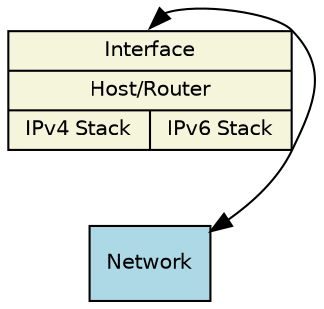
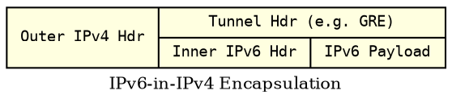
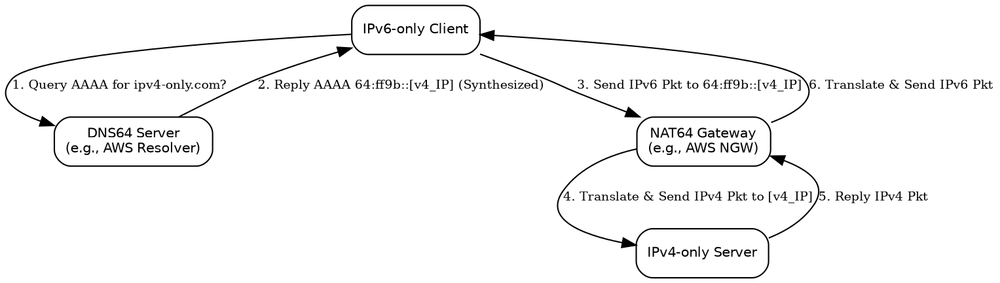

# Day 2: Migration & Coexistence Strategies

*Dual-Stack, Tunneling, Translation*

<aside class="notes">
Welcome to Day 2! Yesterday, we covered a lot of ground, building a solid foundation in IPv6 fundamentals, addressing, and the basic protocol. You also completed two labs: Lab 1 exploring the initial IPv4 state of the Service Provider VPC, and Lab 2 where you manually enabled IPv6 on that VPC and configured egress for new IPv6-only instances. Today, we build on that practical experience and dive into the strategies organizations use to manage the transition from IPv4 to IPv6 and operate in mixed environments. We'll cover Dual-Stack, Tunneling, and Translation in more detail, setting the stage for today's labs where you'll configure NLB ingress and public dual-stack access.
</aside>

---

## Day 2 Agenda

* **Recap:** Day 1 Key Concepts & Labs 1 & 2 Achievements
* **Module 4:** Dual-Stack Deep Dive
* **Quiz 3**
* **Lab 3:** Ingress Connectivity to IPv6-only Instance via NLB *(Morning)*
* **Module 5:** Tunneling Deep Dive
* **Module 6:** Translation Deep Dive (NAT64/DNS64 Recap, NLB Ingress)
* **Quiz 4**
* **Lab 4:** Public Dual-Stack Configuration & Testing (Challenge Lab) *(Afternoon)*

<aside class="notes">
Here's our plan for today. We'll start with a quick recap of Day 1, including the successful completion of both labs. Then we'll dive deep into the most common coexistence strategy: Dual-Stack. After a short quiz, you'll perform Lab 3, configuring inbound access to the IPv6-only instances you set up yesterday using a Network Load Balancer. In the afternoon, we'll cover Tunneling techniques and revisit Translation (NAT64/DNS64), specifically discussing how the NLB fits into that picture. After another quiz, you'll tackle Lab 4, a challenge lab focusing on setting up public dual-stack subnets and instances using the Internet Gateway.
</aside>

---

## Recap: Day 1 Achievements

* **Lectures Covered:** IPv4 vs IPv6, Addressing, Protocol Basics, NDP Intro, EIGW/NAT64 Concepts.
* **Lab 1 Completed:** Explored initial IPv4-only `ServiceProviderVPC` & verified IPv4 connectivity.
* **Lab 2 Completed:**
    * Manually enabled IPv6 on `ServiceProviderVPC`.
    * Created IPv6-only private subnets.
    * Created EIGW for SP VPC.
    * Configured routing for IPv6-only subnets (`::/0 -> EIGW`, `64:ff9b::/96 -> NGW`).
    * Launched instances in IPv6-only subnets & tested outbound connectivity.

<aside class="notes">
Let's quickly recap Day 1. We covered the core IPv6 fundamentals, addressing, protocol details, and key AWS components like EIGW and the concepts behind NAT64/DNS64. Crucially, you completed both labs: Lab 1 involved exploring the Service Provider VPC in its initial IPv4 state and testing basic IPv4 pings. Lab 2 involved the significant task of manually adding IPv6 capabilities to that Service Provider VPC, creating the IPv6-only private subnets, adding the EIGW, configuring the necessary routing for both native IPv6 egress and NAT64 translation, launching instances, and testing their outbound connectivity. Excellent work getting through all that! Today's labs will build directly on the modified Service Provider VPC you configured.
</aside>

---

## Module 4: Dual-Stack Deep Dive

<aside class="notes">
We briefly introduced the main migration strategies yesterday. Now let's take a closer look at the most common approach: Dual-Stack.
</aside>

---

### Migration Strategies Overview (Reminder)

* **Goal:** Allow IPv4 and IPv6 to work together during transition.
* **Main Approaches:**
    * **Dual-Stack:** Run both IPv4 and IPv6 simultaneously. **(Focus Now)**
    * **Tunneling:** Encapsulate IPv6 packets inside IPv4 packets (or vice-versa).
    * **Translation:** Convert packet headers between IPv4 and IPv6 at a gateway.

<aside class="notes">
Just to refresh, the three main ways networks handle the transition are Dual-Stack, Tunneling, and Translation. We'll now focus on Dual-Stack.
</aside>

---

### Dual-Stack Architecture

* **Concept:** Network devices (routers, switches, firewalls) and end hosts (servers, clients) run **both** IPv4 and IPv6 protocol stacks **simultaneously and independently**.
* Each interface typically has both an IPv4 address and one or more IPv6 addresses (LLA + GUA/ULA).
* Applications can use either protocol stack based on destination address resolution and system preference.

<aside class="notes">
What does Dual-Stack mean in practice? It means your network infrastructure components (like routers and firewalls) and your end devices (servers, laptops) are configured to understand and process both IPv4 and IPv6 traffic at the same time. They essentially have two independent network stacks running. An interface on a dual-stack device will typically have at least one IPv4 address and at least two IPv6 addresses (a Link-Local Address, plus usually a Global Unicast Address or Unique Local Address). The operating system and applications decide which protocol to use for a given connection, usually based on DNS results and system preferences (most modern OSes prefer IPv6 if available).
</aside>

---

### How Dual-Stack Works

* **Independence:** IPv4 traffic flows using IPv4 routing tables; IPv6 traffic flows using IPv6 routing tables. They don't directly interact at the IP layer.
* **DNS is Key:** When a client wants to connect to `www.example.com`:
    * It asks DNS for *both* IPv4 (A) and IPv6 (AAAA) records.
    * If it receives *only* an A record, it connects using IPv4.
    * If it receives *only* an AAAA record, it connects using IPv6.
    * If it receives **both**, the OS preference rules apply (usually prefers IPv6 - see RFC 6724/RFC 8305 "Happy Eyeballs").
* Application compatibility is generally high if DNS works correctly.

<aside class="notes">
The key thing about dual-stack is that the two protocols operate largely in parallel. Routers maintain separate routing tables for IPv4 and IPv6. Switches forward frames regardless of the IP version inside. DNS becomes critical. When a dual-stack client wants to reach a service by name, it typically requests both A (IPv4) and AAAA (IPv6) records. The response dictates which protocol stack it attempts to use. If it gets both back, modern operating systems have sophisticated rules (often called 'Happy Eyeballs', specified in RFCs like 6724 and 8305) to decide which to try first (usually IPv6) and how quickly to fall back to the other if the preferred one fails. As long as DNS provides the right addresses, most applications work fine over either protocol without modification.
</aside>

---

### Dual-Stack Configuration Elements

* **Network Devices (Routers/L3 Switches):**
    * Enable IPv6 forwarding (`ipv6 unicast-routing` on Cisco IOS).
    * Assign both IPv4 and IPv6 addresses to Layer 3 interfaces (SVIs, routed ports).
    * Configure both IPv4 routing protocols (e.g., OSPFv2, EIGRP) AND IPv6 routing protocols (e.g., OSPFv3, EIGRPv6). Maintain separate routing tables.
* **End Hosts (Servers/Clients):**
    * Enable IPv6 in the OS.
    * Obtain both IPv4 (DHCP/Static) and IPv6 addresses (SLAAC/DHCPv6/Static).
    * Obtain Default Gateway (v4 & v6 - often via DHCPv4 and NDP RA respectively).
    * Obtain DNS Resolver info (v4 & v6 - often via DHCPv4/v6 or NDP RDNSS).

<aside class="notes">
Configuring dual-stack involves touching various parts of the network. Routers and Layer 3 switches need IPv6 forwarding enabled globally, and relevant interfaces need both IPv4 and IPv6 addresses configured. Crucially, you need to run routing protocols for *both* address families; OSPFv3 doesn't carry IPv4 routes, and OSPFv2 doesn't carry IPv6 routes (though there are exceptions like OSPFv3 Address Families). End hosts need IPv6 enabled, need to acquire addresses for both protocols (often IPv4 via DHCP, IPv6 via SLAAC or DHCPv6), and need gateway and DNS information for both stacks. Router Advertisements (RAs) from NDP are key for providing the IPv6 default gateway and sometimes DNS info (RDNSS option).
</aside>

---

### Dual-Stack in AWS VPCs

* **VPC Level:** Associate both an IPv4 CIDR and an IPv6 CIDR block.
* **Subnet Level:** Assign both an IPv4 CIDR and an IPv6 /64 CIDR.
* **Instances:** Configure to receive both IPv4 and IPv6 addresses upon launch (often default in dual-stack subnets).
* **Routing (Example: Private Dual-Stack Subnet):**
    * Route Table needs separate default routes:
        * `0.0.0.0/0` -> NGW (for IPv4 outbound)
        * `::/0` -> EIGW (for IPv6 outbound)
* **Routing (Example: Public Dual-Stack Subnet):**
    * Route Table needs separate default routes:
        * `0.0.0.0/0` -> IGW
        * `::/0` -> IGW

<aside class="notes">
In AWS, setting up dual-stack follows these principles. You associate both IPv4 and IPv6 CIDR blocks with the VPC. When creating subnets you intend to be dual-stack, you assign ranges from both the IPv4 and IPv6 VPC blocks (using a /64 for IPv6). Instances launched into these subnets can then be configured to get addresses from both families. The routing is critical and distinct. As we saw when exploring the Shared Services VPC and planning Lab 3/4, a private dual-stack subnet needs an IPv4 default route via a NAT Gateway and an IPv6 default route via an Egress-Only IGW. A public dual-stack subnet, however, routes both IPv4 and IPv6 defaults directly via the Internet Gateway.
</aside>

---

### Dual-Stack Pros & Cons

* **Pros:**
    * **High Compatibility:** Supports both IPv4 and IPv6 clients/servers connecting to dual-stack resources.
    * **Gradual Migration:** Allows incremental deployment of IPv6 alongside existing IPv4. Less disruptive.
    * **Native Performance:** No overhead from tunneling or translation for traffic staying within its own protocol.
* **Cons:**
    * **Complexity:** Need to manage and monitor two separate network stacks, routing protocols, addressing plans, firewall rulesets.
    * **Resource Consumption:** Devices need memory/CPU for both stacks; routers need larger routing tables.
    * **Potential Inconsistencies:** Security policies or configurations might accidentally differ between IPv4 and IPv6, creating gaps.
    * **Doesn't Solve Exhaustion Directly:** Still relies on IPv4 (often with NAT) for legacy connectivity.

<aside class="notes">
Dual-stack is popular because it's highly compatible and allows a phased transition. Devices can talk IPv4 when needed and IPv6 when possible, natively. However, it's not without downsides. You essentially double the management overhead – two sets of addresses, routing protocols, firewall rules, monitoring points. Devices need resources to run both stacks, and router tables grow. There's also the risk of configuration drift or oversight, where security policies applied to IPv4 might be forgotten or misapplied for IPv6. And fundamentally, while it enables IPv6, it doesn't eliminate the network's reliance on IPv4, especially for reaching legacy parts of the internet. It's often seen as a necessary transitional step towards eventual IPv6-only operation where possible.
</aside>

---

### Quiz 3: Dual-Stack Concepts

<aside class="notes">
Let's pause here and do a quick quiz on Dual-Stack concepts before we move into the first lab for today.
(Administer Quiz 3 - ~10 mins)
Any questions about Dual-Stack before we start Lab 3?
</aside>

---

### Lab 3: Ingress Connectivity to IPv6-only Instance via NLB

*(Morning Lab)*

<aside class="notes">
Alright, time for Lab 3. In this lab, you'll configure a Network Load Balancer (NLB) to allow inbound connections (like HTTP) to the application running on the IPv6-only instances you set up in the Service Provider VPC during Lab 2. This demonstrates a practical way to make IPv6-only services accessible. Please follow the Lab 3 instructions in your guide.
</aside>

---

### LUNCH BREAK (1 Hour)

---

## Module 5: Tunneling Deep Dive

<aside class="notes">
Welcome back. Before our afternoon lab, we'll explore the second major migration/coexistence category: Tunneling.
</aside>

---

### Tunneling Concepts

* **Purpose:** Carry IPv6 packets over an existing IPv4 network infrastructure (or vice-versa, though less common). Connects IPv6 "islands".
* **Mechanism:** Encapsulation.
    * The original IPv6 packet becomes the payload.
    * A new **IPv4 header** (the "outer" or "delivery" header) is added.
    * Often, a **tunneling protocol header** (like GRE) sits between the outer IPv4 and inner IPv6 headers.
* The entire encapsulated packet travels across the IPv4 network based on the outer IPv4 header.

<aside class="notes">
What is tunneling? It's essentially wrapping one type of packet inside another. In our context, it usually means taking a complete IPv6 packet and putting it inside the data payload of an IPv4 packet. This allows the IPv6 packet to travel across network segments that only understand IPv4. Think of it like putting a letter (IPv6 packet) inside a standard envelope (IPv4 packet) with a standard address to get it through the regular postal system (IPv4 network). At the destination, the envelope is removed, revealing the original letter. An intermediate tunneling protocol header, like GRE, is often used between the outer IPv4 and inner IPv6 headers to provide information for the tunnel endpoints.
</aside>

---

### Manual Tunnels: GRE

* **GRE (Generic Routing Encapsulation):** A common, standard point-to-point tunneling protocol (RFC 2784).
* **How:** Creates a virtual point-to-point link between two endpoints (e.g., routers, servers) over an existing IP network.
    * Requires manual configuration of tunnel source/destination IPv4 addresses on both ends.
    * Encapsulates payload (IPv6) inside GRE header, then inside IPv4 header.
* **Use Cases:** Site-to-site VPNs (often combined with IPsec), connecting specific hosts/networks over IPv4 internet.
* **Lab 5 (Day 3):** We will manually configure a GRE tunnel between instances.

<aside class="notes">
One of the most common types of manual tunnels is GRE. It's flexible and can encapsulate many different protocols, including IPv6 inside IPv4. To set up a GRE tunnel, you manually configure both endpoints. Each end needs to know its own source IPv4 address for the tunnel and the destination IPv4 address of the other endpoint. You create a virtual tunnel interface, assign addresses (like IPv6 addresses) to it, and configure routing to use the tunnel. GRE itself doesn't provide encryption, so it's often paired with IPsec for security when used over public networks. This is the type of tunnel we plan to configure hands-on in Lab 5 tomorrow.
</aside>

---

### Automatic Tunnels: 6to4

* **Concept:** Allows isolated IPv6 hosts/sites to connect to the IPv6 Internet via the IPv4 Internet *automatically*, using special relays.
* **Mechanism:**
    * Derives a `/48` IPv6 prefix directly from a site's **public** IPv4 address (using `2002::/16` prefix).
    * Traffic to other `2002::` addresses can sometimes route directly over IPv4.
    * Traffic to native IPv6 addresses goes to a public "6to4 Relay" router via IPv4 Anycast (`192.88.99.1`). The relay decapsulates and forwards to IPv6 internet.
* **Issues:** Requires public IPv4 (no NAT), reliance on third-party relays (often unreliable, unmanaged, security risks), deprecated by RFC 7526. **Generally not recommended now.**

<aside class="notes">
Historically, several automatic tunneling mechanisms were developed. 6to4 aimed to make connecting easy. If you had a public IPv4 address, you could automatically derive a globally routable `2002::/48` IPv6 prefix from it. Traffic to other 6to4 sites might go directly, but traffic to the native IPv6 internet had to go through a public 6to4 relay router, found using a special Anycast IPv4 address. However, 6to4 suffered from problems: it didn't work well behind NAT, and the public relays were often unreliable or poorly maintained, leading to poor performance and security concerns. It's now considered deprecated and generally shouldn't be used for new deployments.
</aside>

---

### Automatic Tunnels: Teredo

* **Concept:** Provide IPv6 connectivity for individual hosts located *behind* IPv4 NAT devices.
* **Mechanism:**
    * Encapsulates IPv6 packets within **UDP/IPv4** packets (UDP helps with NAT traversal).
    * Uses Teredo servers (for initial setup) and Teredo relays (to reach native IPv6 internet).
    * Assigns special `2001:0::/32` IPv6 addresses.
* **Issues:** Complex, performance limitations, reliance on public servers/relays, potential security concerns, OS support varies. **Also generally not recommended now.**

<aside class="notes">
Teredo was another automatic mechanism, specifically designed to work even when a host was behind one or more layers of NAT. It cleverly encapsulates IPv6 packets inside UDP/IPv4 datagrams, as UDP traffic generally traverses NATs more easily than other protocols like GRE. It involves Teredo servers for setup and relays to connect to the native IPv6 world, using addresses from the `2001:0::/32` prefix. Like 6to4, Teredo suffers from performance issues due to the multiple layers of encapsulation and reliance on public relays. It can also introduce security concerns. While built into some versions of Windows, it's also largely superseded by native IPv6 deployment or dual-stack.
</aside>

---

### Automatic Tunnels: ISATAP

* **ISATAP (Intra-Site Automatic Tunnel Addressing Protocol):**
* **Concept:** Provide IPv6 connectivity to hosts within a single organization's **private** IPv4 network.
* **Mechanism:**
    * Embeds IPv4 address into the IPv6 address Interface ID (using specific prefixes like Link-Local `fe80::...:0:5efe:w.x.y.z`).
    * Hosts automatically discover and tunnel IPv6 traffic (inside IPv4) to a configured ISATAP router within the site.
* **Use Case:** Primarily for enabling IPv6 within an enterprise that is still predominantly IPv4 internally. Not for internet connectivity.

<aside class="notes">
ISATAP is different from 6to4 and Teredo. It's designed for use *within* an organization's private IPv4 network, not for general internet access. It allows IPv6-capable hosts on an IPv4 network to automatically configure an IPv6 address (that embeds their IPv4 address in the Interface ID part) and find a local ISATAP router. They then tunnel IPv6 traffic inside IPv4 packets directly to this internal ISATAP router, which can then route the IPv6 traffic appropriately within the site or potentially onwards if connected to an IPv6 network. It was a way to bootstrap IPv6 usage internally before the underlying network was fully dual-stacked.
</aside>

---

### Tunneling Considerations

* **Overhead:** Encapsulation adds extra headers, slightly increasing packet size and potentially reducing throughput.
* **MTU Issues:** The added headers reduce the effective Maximum Transmission Unit (MTU) for the inner IPv6 packet. Path MTU Discovery (PMTUD) is crucial but can be problematic if ICMPv6 is blocked. Manual MTU clamping might be needed.
* **Complexity:** Manual tunnels require careful configuration at both ends. Automatic tunnels can be complex to troubleshoot.
* **Security:** Tunnels over the internet (like GRE) often need IPsec for encryption/authentication. Automatic tunnels relying on public relays have inherent security risks.
* **When to Use:** Useful for connecting isolated IPv6 networks over IPv4 backbones, site-to-site links, or specific host connections where native IPv6 or dual-stack isn't feasible end-to-end. Generally seen as a transitional tool.

<aside class="notes">
While tunneling works, there are trade-offs. The extra headers add overhead. More significantly, they reduce the available space for the actual payload (MTU). IPv6 relies heavily on Path MTU Discovery (PMTUD) to determine the correct packet size, but PMTUD requires ICMPv6 'Packet Too Big' messages to work. If firewalls block these messages (a common misconfiguration), connections over tunnels can fail mysteriously. Manual tunnels need careful setup, and automatic ones can be hard to debug when they fail. Security is also a major consideration, especially over public networks. Generally, tunneling is a useful tool for specific scenarios during transition but aim for native dual-stack or IPv6-only where possible.
</aside>

---

## Module 6: Translation Deep Dive (NAT64/DNS64)

<aside class="notes">
The third major category is Translation, where we actually convert between protocols. We introduced NAT64/DNS64 yesterday, let's revisit it and discuss how it relates to Lab 3's NLB setup.
</aside>

---

### Translation Recap

* **Purpose:** Allow communication between IPv6-only and IPv4-only devices/networks when dual-stack or tunneling isn't feasible end-to-end.
* **Key Mechanism:** NAT64/DNS64 (Focus for IPv6 -> IPv4 communication).
* **Other Types:** SIIT (Stateless), NAT46 (IPv4 -> IPv6).

<aside class="notes">
Translation is needed when you have endpoints that only speak one protocol needing to talk to endpoints that only speak the other. Dual-stack requires both ends to support both; tunneling requires the endpoints to support the inner protocol and the path to support the outer. Translation bridges the gap directly at a gateway. The most common scenario is needing IPv6-only clients to reach IPv4-only servers, which uses NAT64 and DNS64.
</aside>

---

### NAT64/DNS64 Refresher

* **DNS64:** Synthesizes AAAA record (`64:ff9b::/96` + IPv4) if only A record exists.
* **Client:** Sends IPv6 packet to synthesized address.
* **Routing:** Directs `64:ff9b::/96` traffic to NAT64 gateway (e.g., AWS NGW).
* **NAT64 Gateway:** Translates IPv6 packet -> IPv4 packet (statefully).
* **Setup in Lab 2:** You configured the routing (`64:ff9b::/96 -> NGW`) for the IPv6-only subnets in the Service Provider VPC. AWS DNS handled DNS64.

<aside class="notes">
Quick refresher from yesterday and the detailed slide: DNS64 creates a 'fake' IPv6 address embedding the real IPv4 address when an IPv6-only client queries DNS for an IPv4-only host. The client sends traffic to this fake IPv6 address. Your routing setup directs this specific traffic (destined for the `64:ff9b::/96` prefix) to the NAT Gateway. The NAT Gateway performs the stateful translation from IPv6 to IPv4 and sends it on. You set up the routing part of this in Lab 2 for the Service Provider VPC's IPv6-only subnets.
</aside>

---

### Lab 3 Context: NLB for IPv6-only Ingress

* **Problem:** Your IPv6-only instances (from Lab 2) can talk *out*, but how do external clients (IPv4 or IPv6) talk *in* to them? They are in private subnets with no direct inbound path via IGW or EIGW.
* **Solution:** Use a Load Balancer with public-facing IPs.
* **AWS Network Load Balancer (NLB):**
    * Can be provisioned with **Dual-Stack** IP addresses (gets both public IPv4 and public IPv6 addresses).
    * Can have **IPv6 Listeners** (listens for incoming connections on its IPv6 address).
    * Can forward traffic to **IPv6 Target Groups** containing your IPv6-only instances.
* **Lab 3:** You will configure an internet-facing NLB to accept connections on its public IPv6 address and forward them to your private IPv6-only instances.

<aside class="notes">
Now, let's connect this to Lab 3. Your IPv6-only instances created in Lab 2 can get *out* to the internet (via EIGW for IPv6, via NGW/NAT64 for IPv4). But how does someone from the internet connect *in* to a service running on those instances? They're in private subnets. The standard AWS solution is a load balancer. Specifically, the Network Load Balancer (NLB) can be configured for dual-stack operation. This means the NLB itself gets both a public IPv4 and a public IPv6 address. You can configure an IPv6 listener on the NLB to accept incoming connections on its public IPv6 address. This listener then forwards the traffic to a target group containing your backend instances. Importantly, the target group can contain instances identified by their *IPv6 addresses*, even if they are in IPv6-only subnets. This is exactly what you will configure in Lab 3: an internet-facing NLB acting as the public IPv6 entry point, forwarding traffic to your private IPv6-only application instances.
</aside>

---

### Other Translation Types (Briefly)

* **SIIT (Stateless IP/ICMP Translation - RFC 7915):**
    * Translates headers algorithmically without maintaining connection state.
    * Requires a specific mapping between IPv4 and IPv6 address pools.
    * Less common than NAT64, used in specific scenarios (e.g., some DC interconnects).
* **NAT46:**
    * Translates IPv4 clients -> IPv6 servers.
    * Less common use case currently, but may grow as more services become IPv6-only.

<aside class="notes">
Just for completeness, besides NAT64/DNS64, there are other translation types. SIIT performs stateless translation, which avoids the overhead of state tables but requires careful address pool mapping and doesn't handle port translation like NAT does. NAT46 does the reverse of NAT64, allowing IPv4-only clients to reach IPv6-only servers, which is less common today but might become more relevant in the future. These aren't things we'll configure, but it's good to know they exist.
</aside>

---

### Translation Considerations

* **Statefulness (NAT64):** Like NAT44, requires gateway to maintain connection state (memory/CPU usage, potential single point of failure).
* **Performance:** Translation adds some latency and processing overhead compared to native communication.
* **Application Compatibility (ALGs):** Protocols that embed IP addresses within their payload (e.g., older FTP, SIP) may break when translated unless an Application Layer Gateway (ALG) understands and fixes the payload.
* **End-to-End Principle:** Translation fundamentally breaks the direct end-to-end connection model.
* **Logging/Troubleshooting:** Can be harder to trace connections across the translation boundary.

<aside class="notes">
Like NAT in IPv4, translation mechanisms like NAT64 have implications. They require the translating gateway (like the NGW) to maintain state, which uses resources. The translation process itself adds a small amount of latency. Certain applications, especially older ones that embed IP addresses inside their data streams, might not work correctly across a translator without a helper ALG. And fundamentally, translation breaks the original end-to-end principle of the internet, which can sometimes complicate troubleshooting or certain architectures. It's a necessary tool for coexistence but has trade-offs compared to native dual-stack or IPv6-only.
</aside>

---

### Quiz 4: Tunneling & Translation

<aside class="notes">
Okay, that covers the details of Tunneling and Translation. Let's do our final quiz for the lecture portion of Day 2.
(Administer Quiz 4 - ~10 mins)
Any questions on Tunneling or Translation before we start the afternoon lab?
</aside>

---

### Lab 4: Public Dual-Stack Configuration & Testing (Challenge Lab)

*(Afternoon Lab)*

<aside class="notes">
For our final lab today, Lab 4, you'll configure public dual-stack subnets and instances within the Service Provider VPC. This will likely be presented as more of a challenge lab, providing objectives and high-level guidance rather than detailed click-by-click instructions, encouraging you to apply what you've learned about subnets, routing tables, IGW, and instance configuration for both IPv4 and IPv6. Refer to your Lab Guide for the specific scenario and tasks.
</aside>

---

### Day 2 Wrap-up

* **Covered:** Dual-Stack architecture & configuration, Tunneling mechanisms (GRE, 6to4, Teredo, ISATAP), Translation mechanisms (NAT64/DNS64 recap, NLB for ingress).
* **Lab 3:** Configured NLB for ingress to IPv6-only instances.
* **Lab 4:** Configured and tested Public Dual-Stack subnets/instances.
* **Tomorrow (Day 3):** Management & Security (IPAM, Monitoring, Troubleshooting, Routing Protocols, DNS, Firewalls, IPsec) + GRE Tunneling Lab.

<aside class="notes">
Let's wrap up Day 2. We took a deep dive into the main migration and coexistence strategies: Dual-Stack, Tunneling, and Translation. We looked at how dual-stack operates in AWS, the different types of tunnels and their use cases, and revisited NAT64/DNS64, including how an NLB can provide ingress for IPv6-only services, which you configured in Lab 3. In Lab 4, you tackled the challenge of setting up public dual-stack resources. Tomorrow, we shift focus to Day 3: Management and Security, covering topics like address planning, monitoring, troubleshooting, routing protocols, DNS details, and security best practices, culminating in the hands-on GRE tunneling lab. Any final questions today?
</aside>
