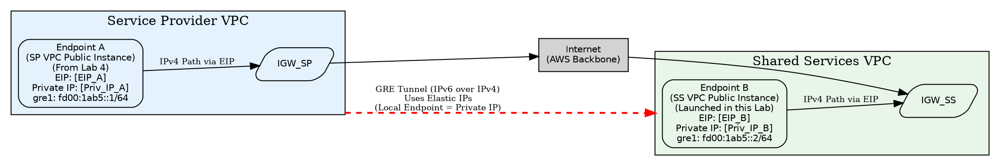

## Lab 5: Configuring an IPv6-over-IPv4 GRE Tunnel (using EIPs)

**Goal:** Manually configure a GRE tunnel between two EC2 instances located in different VPCs (Service Provider VPC and Shared Services VPC) using **Elastic IPs (EIPs)** for stable public endpoints, and encapsulate IPv6 traffic over this connection.

**Prerequisites:**

* Completion of Lab 4 (A running public dual-stack EC2 instance in the `ServiceProviderVPC`, e.g., `SP-Public-DualStack-Demo`). This will be **Endpoint A**.
* Access via Session Manager to Endpoint A.
* Knowledge of how to launch EC2 instances and configure Security Groups (from Lab 4).
* The `SharedServicesVPC` and its public dual-stack subnets (e.g., `SharedServicesVPCPublicSubnet1`) created by the initial CloudFormation template.
* Permissions to allocate and associate Elastic IPs.

---

### Conceptual Diagram



*(Note: Replace `[EIP_A]`, `[EIP_B]`, `[Priv_IP_A]`, `[Priv_IP_B]` with the actual IPs identified below).*

---

### Step 1: Identify Endpoint A

1.  **Navigate to EC2 Console:** Go to Instances.
2.  **Find Endpoint A:** Locate your `SP-Public-DualStack-Demo` instance (or similar name from Lab 4 in the **Service Provider VPC**). Note its **Instance ID**.

---

### Step 2: Allocate and Associate EIP for Endpoint A

1.  **Allocate EIP:**
    * In the AWS Console, navigate to the **VPC Dashboard** -> **Elastic IPs**.
    * Click **"Allocate Elastic IP address"**. Accept defaults and click **"Allocate"**.
    * Note the allocated **IPv4 address** (this is `EIP_A`).
2.  **Associate EIP:**
    * Select the new EIP. Click **Actions** -> **"Associate Elastic IP address"**.
    * Resource type: **Instance**. Instance: Select **Endpoint A**. Click **"Associate"**.
3.  **Note Private IP:** While Endpoint A is selected in the EC2 console, go to the "Details" tab and note its **Private IPv4 address**. Let's call this `PRIVATE_IP_A`.

---

### Step 3: Launch Endpoint B in Shared Services VPC

1.  **Launch Instance:** Click "Launch instances".
2.  **Name:** Give it a name (e.g., `SS-Public-GRE-EndpointB`).
3.  **AMI:** Select the same AMI used previously (e.g., Amazon Linux 2).
4.  **Instance Type:** Select `t2.micro` or `t3.micro`.
5.  **Key Pair:** Select **"Proceed without a key pair"**.
6.  **Network Settings:** Click **Edit**.
    * **VPC:** Select **`SharedServicesVPC`**.
    * **Subnet:** Select one of the **public** subnets in the Shared Services VPC (e.g., `SharedServicesVPCPublicSubnet1`).
    * **Auto-assign Public IP:** Set to **Disable**. *(We will associate an EIP instead)*.
    * **Auto-assign IPv6 IP:** Ensure this is **Enabled**.
    * **Firewall (Security Groups):**
        * Select **"Create security group"**.
        * **Name/Description:** `Lab5-GRE-EndpointB-SG` / Allows GRE and ICMP from Endpoint A EIP.
        * **Inbound Rules:**
            * Add Rule 1: Type: `Custom Protocol`, Protocol: `GRE` (47), Source type: `Custom`, Source: `[EIP_A]/32` (Enter Endpoint A's **Elastic IP**).
            * Add Rule 2: Type: `All ICMP - IPv4`, Source type: `Anywhere-IPv4`.
            * Add Rule 3: Type: `All ICMP - IPv6`, Source type: `Anywhere-IPv6`.
7.  **Advanced Details:** Expand this section.
    * **IAM instance profile:** Select the profile created by the CloudFormation template (`InstanceProfileForEC2`).
8.  **Launch Instance:** Review and click "Launch instance".
9.  **Wait:** Wait for the instance to be "Running". Note its **Instance ID**.

---

### Step 4: Allocate and Associate EIP for Endpoint B

1.  **Allocate EIP:**
    * Go back to VPC -> **Elastic IPs**. Allocate a second EIP.
    * Note the allocated **IPv4 address** (this is `EIP_B`).
2.  **Associate EIP:**
    * Select this second EIP. Click **Actions** -> **"Associate Elastic IP address"**.
    * Resource type: **Instance**. Instance: Select **Endpoint B**. Click **"Associate"**.
3.  **Note Private IP:** While Endpoint B is selected in the EC2 console, go to the "Details" tab and note its **Private IPv4 address**. Let's call this `PRIVATE_IP_B`.

---

### Step 5: Connect to Instances

1.  **Connect to Endpoint A:** Use Session Manager via the AWS Console to connect to your SP VPC Public Instance (Endpoint A).
2.  **Connect to Endpoint B:** Use Session Manager via the AWS Console to connect to the Shared Services VPC Public Instance (Endpoint B). You should now have two separate terminal sessions open.

---

### Step 6: Configure Security Group for Endpoint A

1.  **Find SG for Endpoint A:** Identify the Security Group attached to Endpoint A (e.g., `Lab4-Public-Demo-SG`).
2.  **Modify SG for Endpoint A:**
    * Go to VPC -> Security Groups, find the SG for Endpoint A.
    * Select the "Inbound rules" tab, click "Edit inbound rules".
    * **Remove** any previous GRE rules if they exist.
    * Click "Add rule".
    * Type: `Custom Protocol`
    * Protocol: `GRE` (or enter protocol number `47`)
    * Source type: `Custom`
    * Source: Enter the **Elastic IP address of Endpoint B** (`EIP_B`), followed by `/32`.
    * Click "Save rules".
3.  **(Verification): Ensure Endpoint B's SG (`Lab5-GRE-EndpointB-SG`) correctly allows inbound GRE from Endpoint A's Elastic IP (`EIP_A`), as configured in Step 3.**

---

### Step 7: Load GRE Kernel Module (On Both Instances)

1.  **On Endpoint A:**
    ```bash
    sudo modprobe ip_gre
    ```
2.  **On Endpoint B:**
    ```bash
    sudo modprobe ip_gre
    ```

---

### Step 8: Create Tunnel Interface (On Both Instances)

**(Instructor Note:** Use the **partner's EIP** for `remote` and the **instance's own Private IP** for `local`).

1.  **On Endpoint A:** Run the following, replacing placeholders:
    ```bash
    # Remote = Partner's EIP, Local = My Private IP
    sudo ip tunnel add gre1 mode gre remote [EIP_B] local [PRIVATE_IP_A] ttl 255
    ```
2.  **On Endpoint B:** Run the following, replacing placeholders:
    ```bash
    # Remote = Partner's EIP, Local = My Private IP
    sudo ip tunnel add gre1 mode gre remote [EIP_A] local [PRIVATE_IP_B] ttl 255
    ```

---

### Step 9: Bring Tunnel Interface Up (On Both Instances)

1.  **On Endpoint A:**
    ```bash
    sudo ip link set gre1 up
    ```
2.  **On Endpoint B:**
    ```bash
    sudo ip link set gre1 up
    ```
3.  **(Verification Optional):** Run `ip addr show gre1` on both instances.

---

### Step 10: Assign IPv6 Addresses to Tunnel (On Both Instances)

1.  **On Endpoint A:**
    ```bash
    sudo ip -6 addr add fd00:1ab5::1/64 dev gre1
    ```
2.  **On Endpoint B:**
    ```bash
    sudo ip -6 addr add fd00:1ab5::2/64 dev gre1
    ```
3.  **(Verification Optional):** Run `ip -6 addr show gre1` on both instances.

---

### Step 11: Test Tunnel Connectivity

1.  **From Endpoint A:** Ping the IPv6 address assigned to Endpoint B's tunnel interface:
    ```bash
    ping6 -c 4 fd00:1ab5::2
    ```
    *You should see successful replies.*
2.  **From Endpoint B:** Ping the IPv6 address assigned to Endpoint A's tunnel interface:
    ```bash
    ping6 -c 4 fd00:1ab5::1
    ```
    *You should see successful replies.*

---

### Step 12: Observe Encapsulation (Optional)

1.  **On Endpoint A (or B):** Start `tcpdump` filtering for GRE on `eth0`:
    ```bash
    # Filter based on partner's EIP
    sudo tcpdump -i eth0 proto 47 and host [EIP_B_or_EIP_A] -n -v
    ```
2.  **From Endpoint B (or A):** Initiate the `ping6` command again from Step 11.
3.  **Observe:** Look at the `tcpdump` output. You should see IPv4 packets using the **Elastic IPs** as source/destination with `proto GRE (47)`. Stop `tcpdump` with `Ctrl+C`.

---

### Step 13: Lab Summary & Cleanup

* **Summary:** We used **Elastic IPs** to provide stable public IPv4 endpoints. We launched a second EC2 instance in a different VPC's public subnet. We configured Security Groups to allow GRE traffic between the EIPs. We loaded the GRE module, manually configured the tunnel interface using the partner's EIP as `remote` and the instance's Private IP as `local`, assigned IPv6 addresses, and verified IPv6 connectivity *through* the tunnel.
* **Cleanup:**
    * *(Optional)* Bring down/delete tunnel interfaces: `sudo ip link set gre1 down && sudo ip tunnel del gre1` (on both).
    * *(Important)* **Terminate** both EC2 instances used (Endpoint A from Lab 4, Endpoint B created here).
    * *(Important)* **Disassociate** both Elastic IPs from the instances/interfaces (Actions -> Disassociate Elastic IP address).
    * *(Important)* **Release** both Elastic IPs (Actions -> Release Elastic IP addresses) to avoid charges.
    * *(Optional)* Delete Security Groups created (`Lab4-Public-Demo-SG`, `Lab5-GRE-EndpointB-SG`) and revert changes to existing SGs if necessary.

---